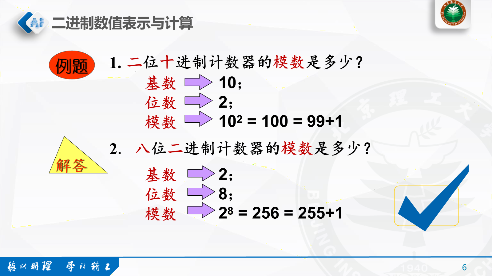

# 二、计算机信息数字化基础

by Len Fu 12.10.2024

## 1. 二进制基础
### 1.1 基本概念
- **数制**：数的表示系统
- **基数**：数制所包含的符号的个数
- **权**/**位值**：由位置决定的值
### 1.2 数制间转换
#### 1.2.1 非十进制数转换十进制
**按权展开法**
Example:
    二->十：
    $(1001011.1010)_{2}=1*2^{6}+1*2^{3}+1*2^{1}+1*2^{0}+1*2^{-1}+1*2^{-3}=75.625$
    
    十六->十：
    $(5CA)_{16}=5*16^{2}+12*16^{1}+10*10^{0}$
    
#### 1.2.2 十进制转换非十进制
**短除短乘法**

## 2. 基本数据表示

### 2.1 整数的计算机表示

- 机器数：数在机器中的编码表示

- 真值：机器数所对应的十进制数值

- 模数：一个计量器的容量 $R^{n}$ R是基数,ns是位数

- **计数器从0**开始计数

- **模数**：计数器所能计的数值的个数即模数

- **模数=最大值+1**

- **模数=$R^{n}$**

### 2.2 原码

**定义**

分别用0和1表示正号和负号，并置于z最高有效位上。绝对值部分置于右边

**表示范围**

$(-2^{n-1}+1,2^{n-1}-1)$

### 2.3 反码

**定义**

正数的反码表示与原码相同，负数的反码表示为其原码的符号位不变，其余各位取反。

**表示范围**

$(-2^{n-1}+1,2^{n-1}-1)$

### 2.4 补码

**定义**

$[X_{补}]=\begin{cases}X,\ for\ X\leq 0 \\ 2^{n}-|X|,\ for\ X<0\end{cases}$

正数的补码表示与原码相同，负数的补码表示为其原码的符号位不变，其余各位取反后加1。

**表示范围**

$(-2^{n-1},2^{n-1}-1)$

**补码运算**

### 2.5 浮点数

**定义**

$M\times R^{E}$

其中M是尾数（数的有效数字），R是基数，E是阶（小数在数中的实际位置）

**规格化**

非零浮点数的尾数最高位必须是1

**格式**

案例

**有效位**

尾数二进制转换为十进制的数字位数

### 2.6 实型变量

### 2.7 逻辑运算

### 2.8 ASCII码

美国标准信息交换码，是目前国际上最为流行的字符信息编码方案。

### 2.9 汉字编码

## 3. 信息编码与信息论