

# 三、计算机硬件体系

by Len Fu 12.10.2024

## 1. 计算机的发展与图灵机模型
### 1.1 计算机发展的历史

**古代计算工具**
手指、木棍、石块、贝壳开始的。

**机械式计算机**
    帕斯卡：钟表齿轮式机械计算机。（逢十进一）
    牛顿：乘法器
    **差分机和分析机**
    分析机：体现了现代电子计算机的结构、设计思想。被称为现代通用计算机的雏形
    巴贝奇：计算机之父
    **程序的出现**
    阿达
    **打孔技术解决输入和输出的自动化**  

**电子计算机的诞生**
- **第一台电子计算机**
    ABC：电子和电器的结合
- **第一台机电式计算机**
    MARK-I：全自动运算
- **第一台数字式电子计算机**
    ENIAC
- **EDEVAC**
    冯·诺伊曼写了一份储存程序计算机的设计原则，奠定了现代计算机架构的基础。
- **电子技术突飞猛进**
    **晶体管**
    贝尔实验室
    **集成电路(IC)**
- **现代电子计算机的四个阶段**
    第一阶段：电子管计算机
    第二阶段：晶体管计算机
    第三阶段：集成电路计算机
    第四阶段：超大规模集成电路计算机

### 1.2 电子元件-逻辑元件-计算部件
#### 1.2.1 逻辑门、基本逻辑运算单元
**非门**
将输入反转

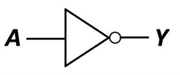

**与非门**
有0，输出为1；
全为1，输出为0；

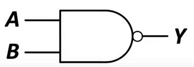

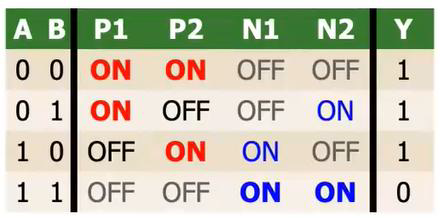

**与门**
全为1，输出为1；
有0，输出为0；

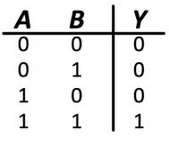

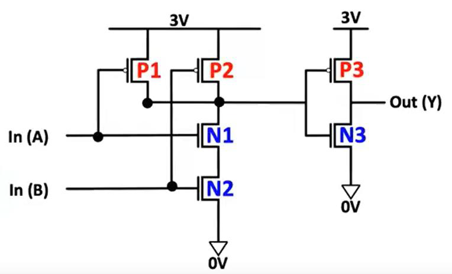

**或门**
有1，输出1；
全为0，输出0；

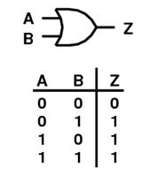

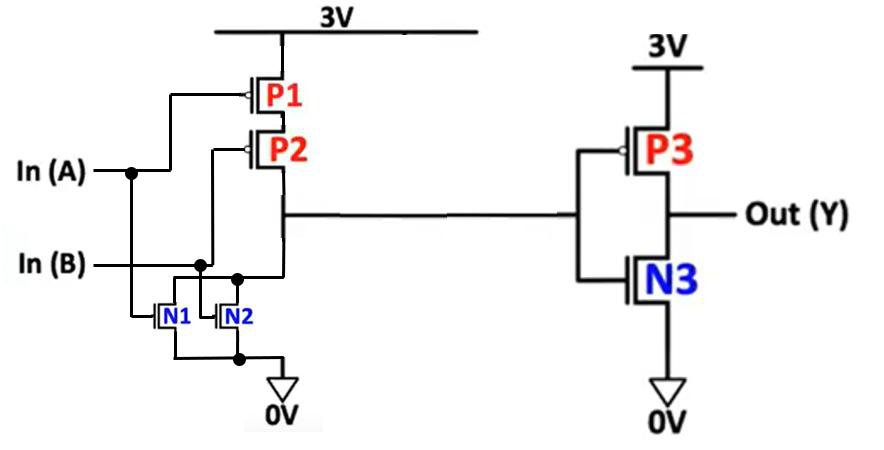

**总览IO表和CMOS元件**
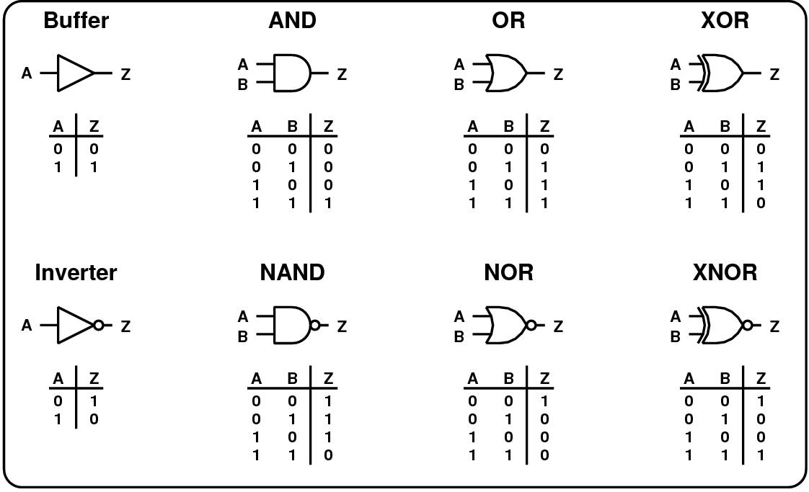

#### 1.2.2 加法器原理
加法器是一种数字电路，用于执行二进制数的加法运算。
**半加器**
最基本的加法器是半加器（Half Adder），它可以处理两个一位二进制数的加法，并产生和（Sum）与进位（Carry）两个输出。半加器的真值表如下：

| A | B | S (和) | C (进位) |
|---|---|-------|---------|
| 0 | 0 |   0   |    0    |
| 0 | 1 |   1   |    0    |
| 1 | 0 |   1   |    0    |
| 1 | 1 |   0   |    1    |

**全加器**
全加器（Full Adder）是半加器的扩展，它可以处理三个一位二进制数的加法，包括两个加数位和一个进位输入。全加器的真值表如下：

| A | B | Cin (进位输入) | S (和) | Cout (进位输出) |
|---|---|--------------|-------|--------------|
| 0 | 0 |        0     |   0   |      0       |
| 0 | 0 |        1     |   1   |      0       |
| 0 | 1 |        0     |   1   |      0       |
| 0 | 1 |        1     |   0   |      1       |
| 1 | 0 |        0     |   1   |      0       |
| 1 | 0 |        1     |   0   |      1       |
| 1 | 1 |        0     |   0   |      1       |
| 1 | 1 |        1     |   1   |      1       |

**加法器的实现**
多位加法器的实现通常基于全加器（Full Adder）的原理，因为全加器能够处理包括进位在内的三位二进制数的加法。要构建一个多位加法器，你需要将多个全加器串联起来，以便每个全加器的进位输出连接到下一个全加器的进位输入。以下是实现多位加法器的基本步骤：

1. 确定位数：首先，确定你需要加法器处理的位数。例如，如果你想构建一个4位加法器，你需要处理4个二进制位的加法。

2. 使用全加器：每个全加器可以处理三个输入：两个加数位和一个进位输入，以及产生一个和位和一个进位输出。

3. 连接全加器：将全加器串联起来，使得第一个全加器的进位输出连接到第二个全加器的进位输入，第二个全加器的进位输出连接到第三个全加器的进位输入，依此类推。

4. 处理初始进位：在最低位（最右边的位）的全加器，进位输入（Cin）通常是0，因为这是加法的起始位。

5. 输出结果：最左边全加器的进位输出（Cout）是最终的进位结果，可能需要额外处理，比如传递给更高位的加法器或者作为溢出标志。

6. 构建多位加法器：对于4位加法器，你可以这样连接：

        A3--B3--Cin(0)--S3--Cout4
            |           |    |
            |           |    +--Cin3--Cout3
            |           +--Cin2--Cout2
            +--Cin1--Cout1
在这个例子中，A3和B3是两个4位加数的最高位，Cin(0)是初始进位输入，通常设置为0。S3是最高有效位的和，Cout4是最高位的进位输出。

7. 扩展到更多位：如果需要更多位的加法器，只需继续添加更多的全加器，并按照上述方式连接。

8. 考虑溢出：在实际的计算机系统中，加法器可能会有一个溢出标志，用于指示结果是否超出了加法器可以表示的范围。

一般来说，对于一个n位加法器，你需要n个全加器来处理每一位的加法，以及将前一位的进位传递到下一位。每个全加器负责计算一位的和与进位，并将进位传递给下一个全加器。

## 2. 计算机硬件体系

### 2.1 冯·诺伊曼型计算机的三条思想

1. **存储程序**
    冯·诺依曼体系结构的核心是存储程序概念，即程序指令和数据可以一起存储在计算机的内存中。这意味着计算机可以自动从内存中读取指令并执行它们，而不需要外部干预。这种设计使得程序能够动态地修改自己的行为，从而实现更复杂的计算和数据处理。
2. **二进制系统**
    冯·诺依曼体系结构使用二进制系统来表示数据和指令。所有的数据和指令都被编码成二进制形式，这简化了电子电路的设计，并使得使用电子开关（如晶体管）来构建计算机成为可能。二进制系统也为逻辑运算和算术运算提供了基础，因为这些运算可以用简单的逻辑门（AND、OR、NOT）来实现。
3. **程序控制单元（PCU）和算术逻辑单元（ALU）分离**
    在冯·诺依曼体系结构中，程序控制单元（PCU）负责从内存中取出指令并解码，然后根据指令控制计算机的其他部分。算术逻辑单元（ALU）则负责执行所有的算术和逻辑运算。这种分离允许程序控制流和数据处理并行进行，提高了计算机的效率。

### 2.2 计算机的硬件组成

#### 2.2.1 控制器（CU）
**功能**
指挥计算机的各个部件按照指令的功能要求协调工作。

1. **指令寄存器（IR）**
    指令寄存器（IR）是计算机的核心部件，用于存储当前正在执行的指令。它通常是一个只读寄存器，用于存储从内存中取出的指令。
2. **程序计数器（PC）**
    程序计数器（PC）是另一个重要的部件，用于存储下一条要执行的指令的地址。它通常是一个可读写的寄存器，用于指示当前指令在内存中的位置。
3. **指令译码器（ID）**
    指令译码器（ID）负责将指令寄存器中的指令进行译码，以确定指令的操作类型和操作数。它根据指令的操作码和操作数的地址来确定指令的含义。

#### 2.2.2 运算器（ALU）
**功能**
进行算术运算和逻辑运算。
1. **算术逻辑单元（ALU）**
    算术逻辑单元（ALU）是计算机的核心部件，用于执行各种算术和逻辑运算。它包括加法器、减法器、乘法器、除法器等基本运算单元，以及逻辑门（如与门、或门、非门等）来实现复杂的逻辑运算。
2. **累加器（ACC）**
    累加器（ACC）是ALU的一个重要部件，用于存储中间结果和最终结果。它通常是一个可读写的寄存器，用于存储算术运算的中间结果。
3. **通用寄存器**
    通用寄存器是ALU的另一个重要部件，用于存储数据和指令。它们通常是可读写的寄存器，用于存储数据和指令。
4. **状态寄存器**
    状态寄存器用于存储ALU的状态信息，如进位标志、溢出标志等。它们通常是可读写的寄存器，用于存储ALU的状态信息。

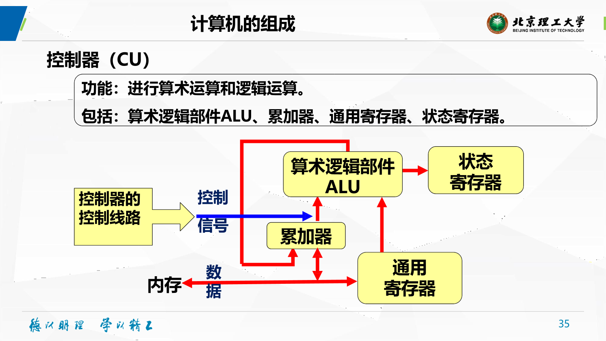

#### 2.2.3 存储器
**功能**
用来储存数据和程序，按照指定位置读写二进制信息。
1. **内存储器**
    内存储器是计算机的核心部件，用于存储数据和程序。计算机直接从内存中存取信息。
2. **外存储器**
    外存储器是计算机的辅助部件，用于存储数据和程序。它通常是一个硬盘驱动器，用于存储数据和程序。一般只和内存进行数据交换。

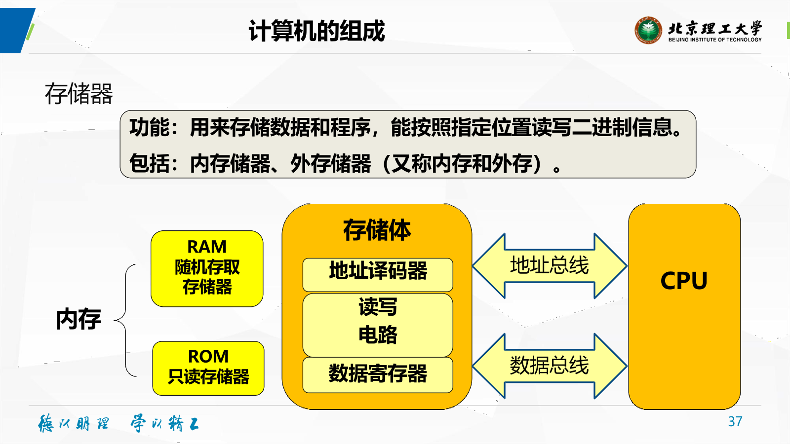

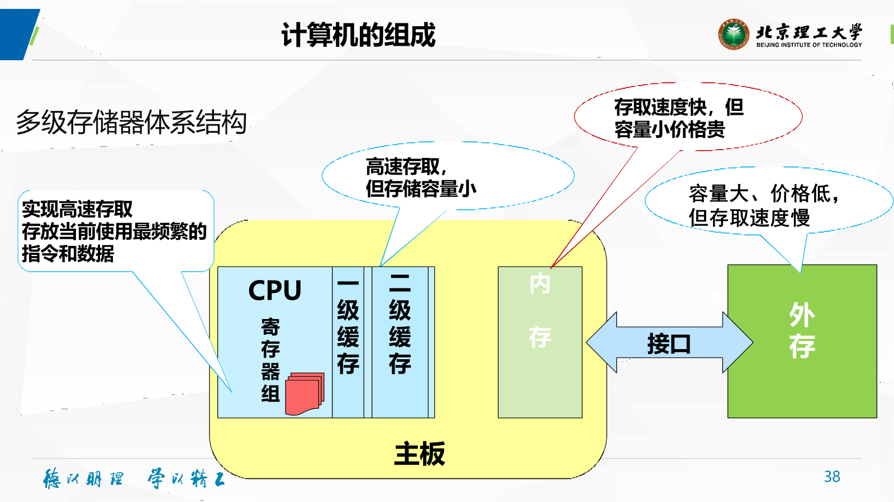

### 2.3 计算机的储存体系
1. **主存储器**
    又称为“主存”或 “内存”。其存取速度直接影响计算机的整体运行速度。
    内存按信息的存取方式分为两种：ROM和RAM。ROM(Read Only Memory，简称ROM) 信息一旦写入就不能更改。ROM的主要作用是完成对计算机的启动、自检、各功能模块的初始化、系统引导等重要功能，只占很小的一部分。
    RAM (Random Access Memory，简称RAM)称为随机存储器，需要电源的支持，一旦切断电源，其中的所有数据立即完全消失。
2. **重要概念**
    1. 位（bit）
        二进制的一位，0或1。最小的计算机信息单位。
    2. 字节（Byte）
        8个二进制位组成一个字节。计算机度量存储容量的计量单位。
    3. 字（Word）
        计算机能同时处理的一组二进制数，成为一个计算机的字。
    4. 地址（Address）
        所有存储单元构成一个存储矩阵，对每个存储单元按一定的顺序编号，这个编号被称为“地址”。
    5. 存储容量
        存储容量是指计算机所能存储的二进制信息的总量， 以字节为最小的计量单位。
        存储容量的单位
            1. 字节（B）
            2. 千字节（KB）
            3. 兆字节（MB）
            4. 吉字节（GB）
            5. 太字节（TB）
            6. 拍字节（PB）
            7. 艾字节（EB）

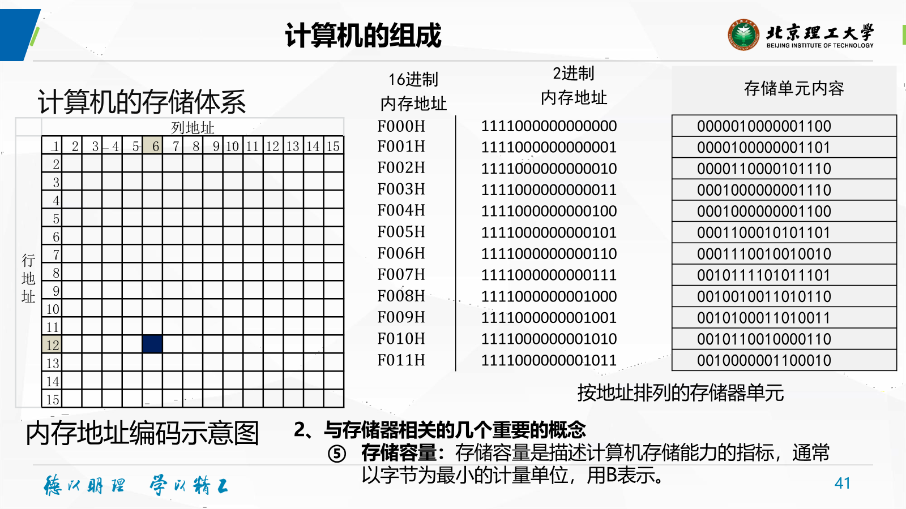

## 3. 计算机基本工作原理
### 3.1 计算机的指令系统
#### 3.1.1 指令
一条指令通常有操作码和地址码两部分组成。
**指令编码**
通过指令以二进制编码形式表示，即由一串二进制排列组合而成的字符串，其中的所有信息都是计算机硬件能识别的，所以又称为机器指令。

#### 3.1.2 指令系统
每种计算机都规定了确定数量的指令，这批指令的总和称为计算机的指令系统。不同的指令系统所拥有的指令种类和数目是不同的。

一般来说，任何指令系统都应具有五类功能的指令，即：数据传送类、算术运算和逻辑运算类、程序控制类、输入输出类、控制和管理机器类。

要按照问题写出一个指令序列（程序）来解决问题。

#### 3.2 指令周期
**指令周期的主要阶段**
1. 取指（Fetch）：
    在这一阶段，中央处理单元（CPU）从内存中获取当前要执行的指令。程序计数器（Program Counter, PC）指向指令在内存中的地址，CPU使用这个地址读取指令并将其存储在指令寄存器（Instruction Register, IR）中。
    取指后，程序计数器会更新，指向下一条指令的地址。
2. 译码（Decode）：
    在这一阶段，CPU对取出的指令进行译码。控制单元（Control Unit, CU）分析指令的操作码（Opcode），确定要执行的操作类型，以及操作数（Operands），即指令所需的数据或地址。
    译码的结果将决定后续的执行步骤。
3. 执行（Execute）：
    在这一阶段，CPU根据译码的结果执行相应的操作。这可能包括算术运算、逻辑运算、数据传输等。
    如果指令涉及到算术逻辑单元（ALU），则ALU会执行相应的运算。
4. 访存（Memory Access）（可选）：
    如果指令需要访问内存（例如，读取或写入数据），则在这一阶段进行内存操作。根据指令的要求，CPU会从内存中读取数据或将计算结果写入内存。
5. 写回（Writeback）（可选）：
    在这一阶段，执行结果会被写回到寄存器或内存中，以便后续使用。这一步通常在涉及数据存储的指令中进行。

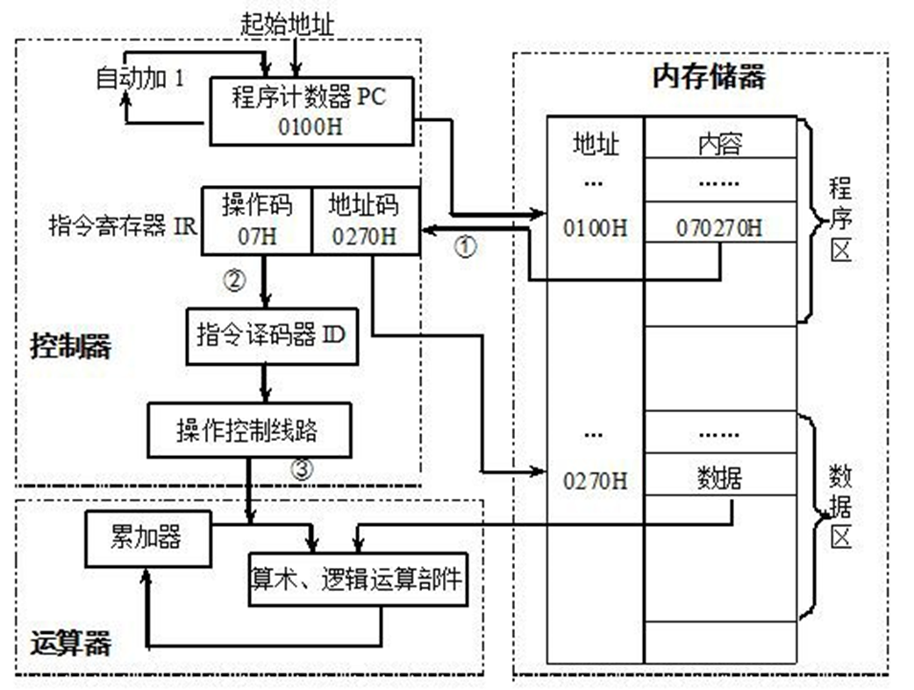

## 4. 微型计算机体系

所谓微型计算机，首先是它体积小，同时具有如下功能和配置：能够自己完成输入、处理、输出和存储操作，并至少配备一个输入设备、输出设备、外存储设备、内存和一个微处理器，这样形成它的硬件系统，自成体系。

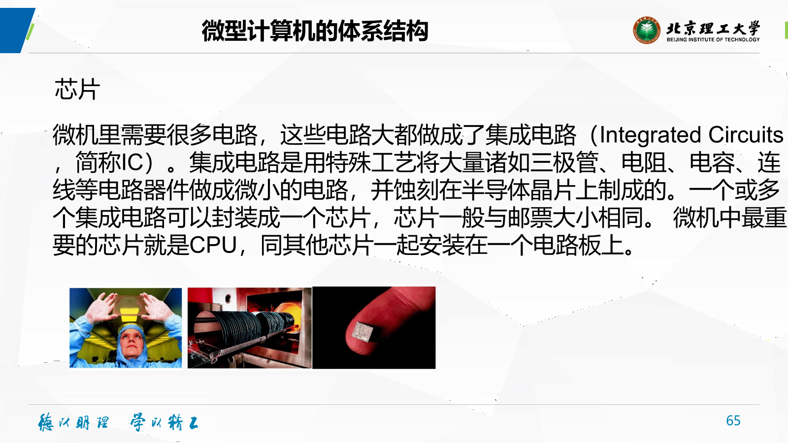

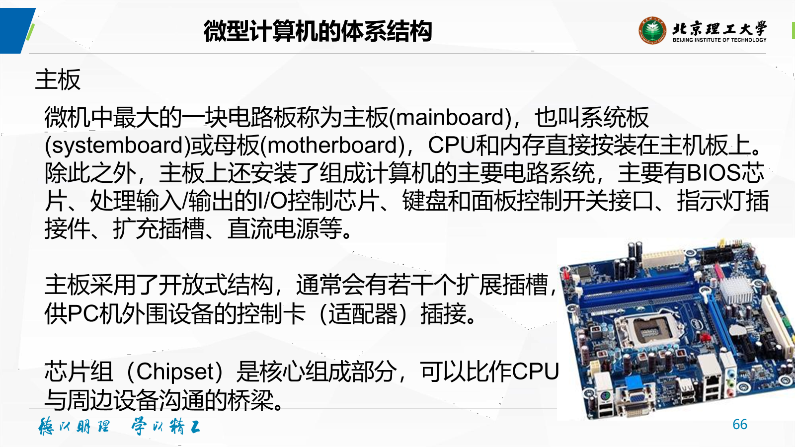

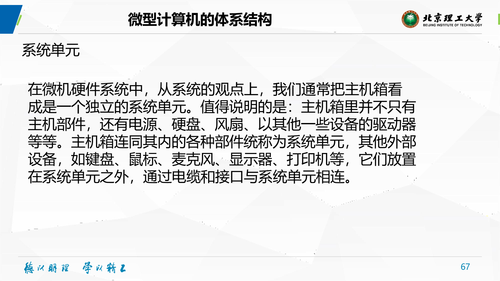

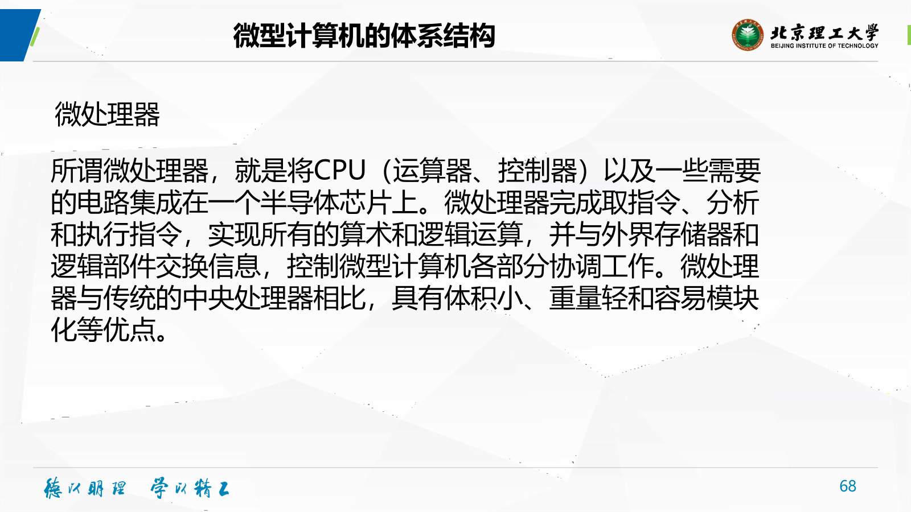

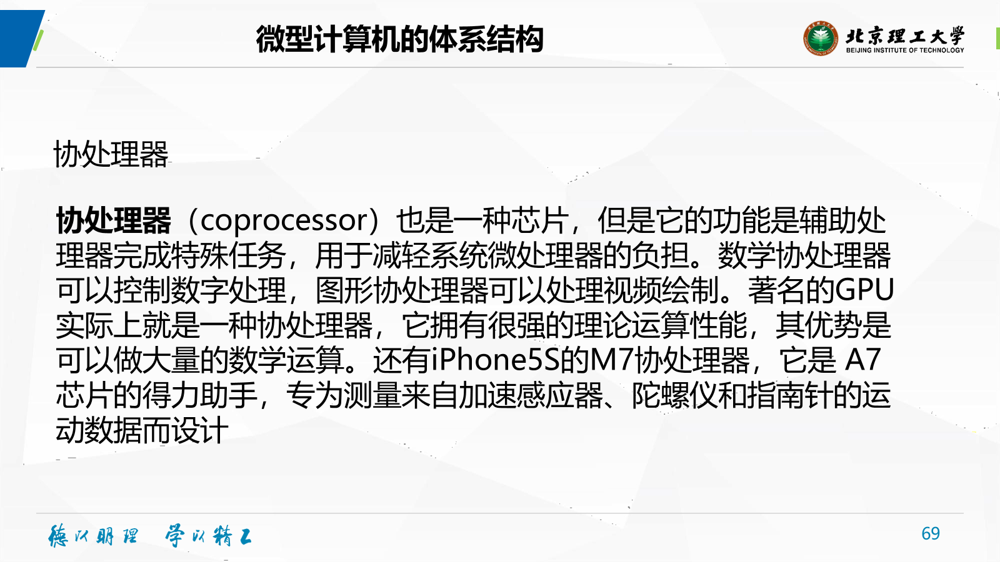

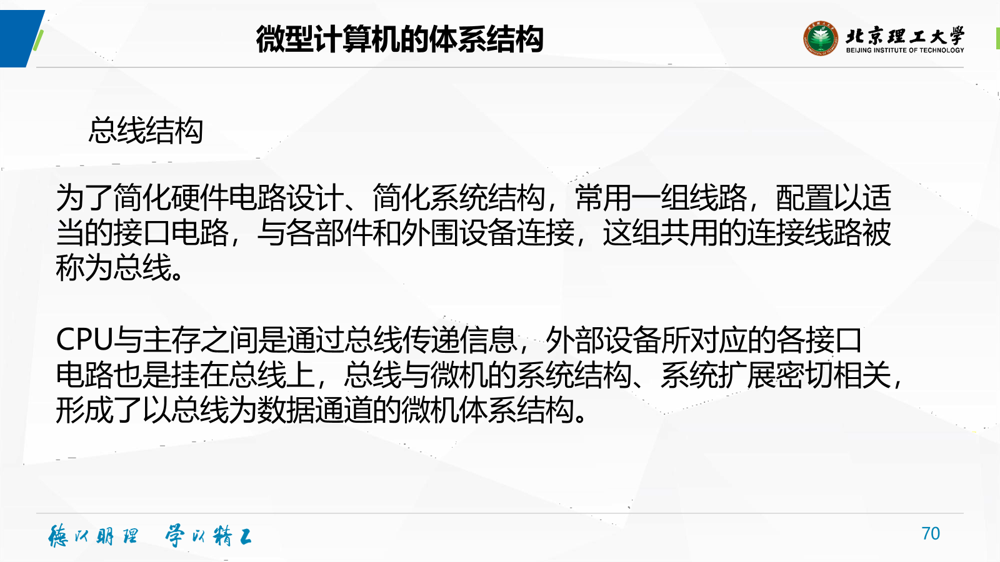

### 4.1 结构总线的概念和分类

#### 4.1.1 总线的概念和分类
**概念**
为了简化硬件电路设计、简化系统结构，常用一组线路，配置以适当的接口电路，与各部件和外围设备连接，这组共用的连接线路被成为总线。

CPU与主存之间总是通过总线传递信息，外部设备所对应的各接口电路也是挂在总线上，总线与微机的系统结构、系统拓展密切相关，形成了以总线为数据通道的微机体系结构。

**分类**
1. 内部总线：
    内部总线是在CPU集成电路芯片内部的总线，是CPU与内部各组件之间互联，所以也叫片总线。
2. 系统总线：
    主要提供了CPU与计算机系统各部分之间的信息通路，它决定了微型机CPU与内存、内部与外部的联络方式。
3. 外部总线：
    外部总线是微机与外部设备之间的信息传输通道， 也称为扩展总线。

#### 4.1.2 系统总线

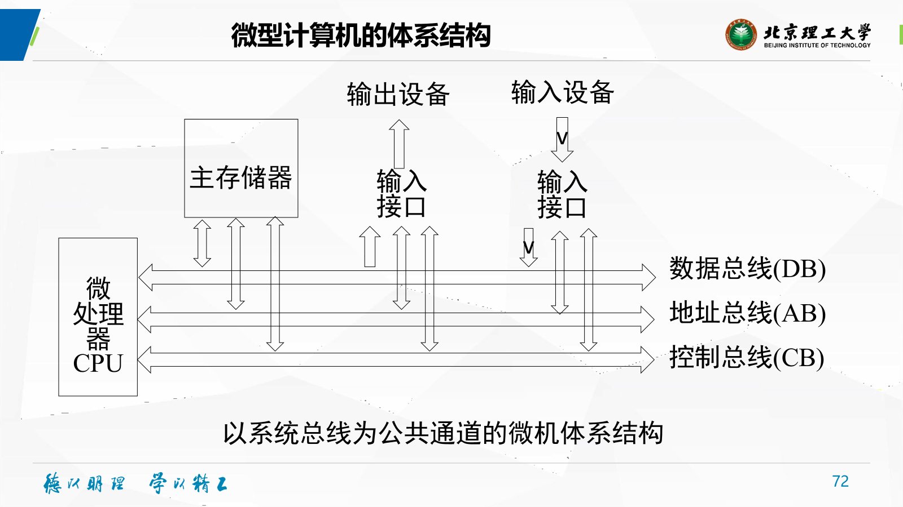

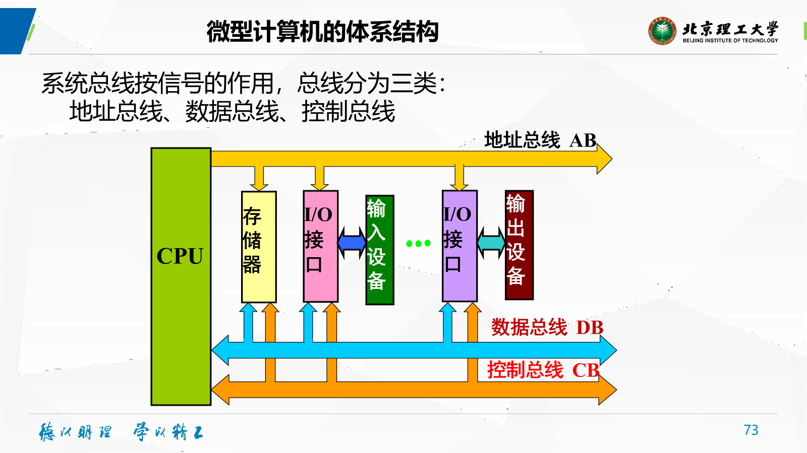

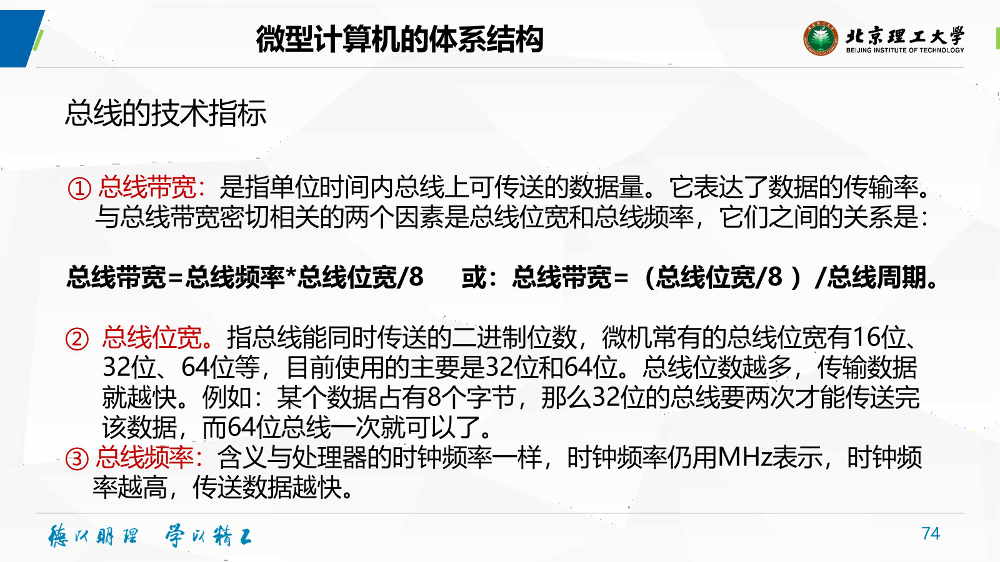

### 4.2 外部设备
除计算机系统以外的设备
**外部存储设备**：内存扩展。
**输入/输出设备**：实现人与计算机的最终交互。
**通信接口**：将外部设备和主机连接，以实现存储、输入和输出。

#### 4.2.1 扩展卡与扩展槽
扩展卡也叫适配器，是实现一种扩展功能的装置，有的扩展卡作为外部设备经过电缆与计算机连接到输入/输出电路。

#### 4.2.2 接口
系统单元和外部电缆的连接处，它可以是扩展卡对的一部分，也可以跳过扩展卡直接和主板相连。
接口应该包括硬件和软件两部分，软件就是设备驱动程序。
**串口**
    每次只能传送一个二进制位
**并口**
    一次传送一组二进制位
**USB接口**
    将不同的接口统一起来，它使用一个4针插头作为标准插头，采用菊花链形式把所有的外设连接起来

### 4.3 显示器
**性能指标**
    - 尺寸
    - 分辨率：像素的个数
    - 点距：像素之间的距离
    - 刷新频率：每秒种重画图像的次数。

### 4.4 CPU
**参数**
    - 字长：处理机运算器一次能完成二进制数运算的位数
    - 主频：CPU的时钟频率，即工作频率
    - 内存储器容量：指内存储器中所有存储单元的总数目，反映了计算机即时存储信息的能力。由地址总线的位数决定。
    - 外存储器容量：指外存储器中所有存储单元的总数目，反映了计算机长期存储信息的能力。
    - 外设扩展能力：可配置外部设备的数量以及配置外部设备的类型，影响整个系统的性能。

### 4.5 多级存储体系结构
微处理器存储层、高速缓冲存储层、主存储层和外存储层。

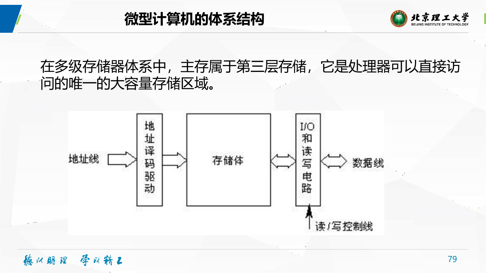

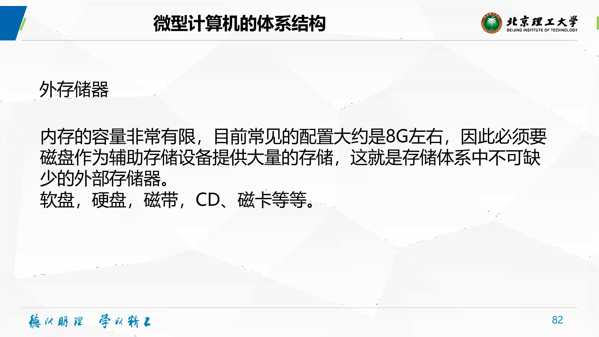

## 5. 并行计算机体系结构

**高性能并行计算技术**的基本原理就是将问题分为若干部分，使用多台计算机可同时参与问题的解决，从而显著缩短了 解决整个问题所需的计算时间。

**并行计算机**，是相对串行计算机而言的，串行就是只有单个处理单元，顺序执行计算程序，所以也称为顺序计算机。顺序计算机最早是从位串行操作到字并行操作、从定点运算到浮点运算不断改进而来；而并行计算机则强调任务并行分配、协作完成、资源共享的理念，所以并行计算机需要多个处理单元组成的计算机系统支持。

