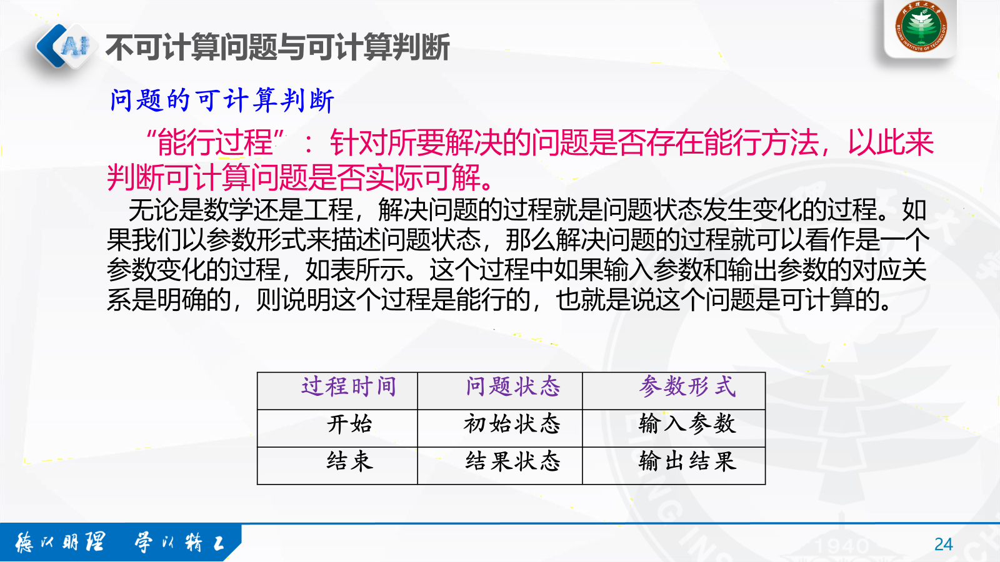

# 四、软件与环境

## 1. 程序设计

### 1.1 面向过程编程设计特点

结构化程序设计方法是面向过程编程应遵循的基本方法和原则。主要包括：

1. 只采用三种基本的程序控制结构（顺序、选择、循环）来编制程序，从而使程序具有良好的结构；
2. 程序设计自顶而下；
3. 用结构化程序设计流程图表示算法。

## 1.2 计算机语言处理系统

## 2. 算法基础

### 2.1 图灵机与可计算

#### 2.1.1 图灵机

图灵机包括以下四个部分：

1. 一条**无限长的纸带**，用于使用二进制符号来表达计算所用的数据和控制规则；

2. 一个**读写头**，用于获取或者改写纸带当前位置上的符号；

3. 一个**状态寄存器**，用于保存图灵机当前所处的状态（包括停机状态）；

4. 一套**控制规则**，它根据当前机器所处的状态以及当前读写头所获取的符号，来确定读写头下一步的动作，并改变状态寄存器的值，令机器进入一个新的状态。

#### 2.1.2 可计算

可计算性是指对于给定的问题，是否存在一种算法可以解决它。

### 2.2 算法复杂度

#### 2.2.1 时间复杂度

计算所需的步数或指令条数.

#### 2.2.2 空间复杂度

计算所需的存储空间大小。

### 2.3 算法的特点

算法具有以下基本特征：

- 有穷性：一个算法必须在执行有限个操作步骤后终止

- 确定性：算法中每一步的含义必须是确切的，不可出现任何二义性

- 有效性：算法中的每一步操作都应该能有效执行，一个不可执行的操作是无效的

- 有零个或多个输入：这里的输入是指在算法开始之前所需要的初始数据，输入的多少取决于特定的问题

- 有一个或多个输出：所谓输出是指与输入有某种特定关系的量，在一个完整的算法中至少会有一个输出。

### 2.4 流程图表示算法

**冒泡排序**

**选择排序**

**插入排序**

