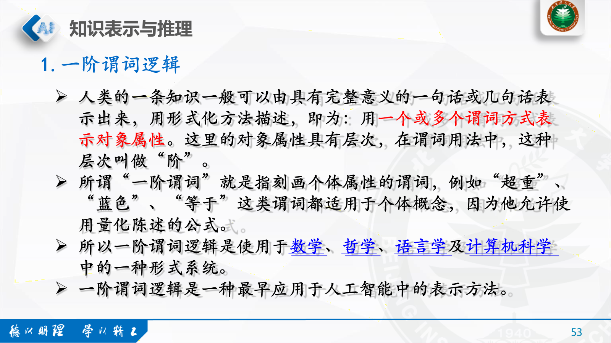

# 五、符号智能

by Len Fu 12.10.2024

## 1. 搜索与问题求解

### 1.1 概念

**搜索**

搜索是人工智能技术中进行问题求解的基本技术，不管是符号智能还是计算智能以及统计智能和交互智能，不管是解决具 体应用问题，还是智能行为本身，最终往往都归结为某种搜索，都要用某种搜索算法来实现。

**解**

问题的解：就是从初始状态到目标状态的一组行动序列。

最优解：所有解里面代价最小的解即为最优解。

**搜索过程中要考虑的问题**

1. 搜索过程是否一定能找到一个解。

2. 当搜索过程找到一个解时，如何判断这个解是最优解。

3. 搜索过程的时间与空间复杂性如何。

4. 搜索过程是否会终止运行或是否会陷入死循环。

**搜索过程的5部分**

### 1.2 状态空间

让计算机知道问题是什么：

**状态空间表示法：状态、操作、状态空间**

#### 1.2.1 状态

#### 1.2.2 操作（算符）

#### 1.2.3 状态空间

**示例**

### 1.3 搜索策略（盲目式）

**回溯搜索**

**图搜索算法的思想**

#### 1.3.1 广度优先搜索

**高价**

**若存在，必有解**

**每次都从最浅的开始**

#### 1.3.2 深度优先搜索

**首先拓展新节点**

##### 注意事项

- 在深度优先搜索中，当搜索到某一个状态时，它所有的子状态以及子状态的后裔状态都必须先于该状态的兄弟状态被搜索。

- 为了保证找到解，应选择合适的深度限制值，或采取不断加大深度限制值的办法，反复搜索，直到找到解。

- 深度优先搜索并不能保证第一次搜索到的某个状态时的路径是到这个状态的最短路径。

- 对任何状态而言，以后的搜索有可能找到另一条通向它的路径。如果路径的长度对解题很关键的话，当算法多次搜索到同一个状态时，它应该保留最短路径。

## 2. 知识表示与推理

**知识表示**

知识表示就是把人类知识符号化或模型化，转换为机器内部的一种数据结构，使得计算机能够方便地存储、处理和利用。

知识表示方法：
- 一阶谓词逻辑表示法

- 产生式表示方法

- 语义网络表示方法

- 框架表示方法

### 2.1 一阶谓词逻辑表示法

一阶谓词逻辑是使用于数学、哲学、语言学及计算机科学中的一种形式系统。

### 2.2 其它表示方法

### 2.3 知识推理

推理是求解的一种基本方法，是从已知事实出发，运用已掌握的知识，推导出其中蕴含的事实性结论，或归纳出某些新的结论的过程。

#### 2.3.1 确定性推理

#### 2.3.2 不确定性推理

## 3. 自然语言处理

### 3.1 主要研究内容

### 3.2 研究困难

### 3.3 研究技术

