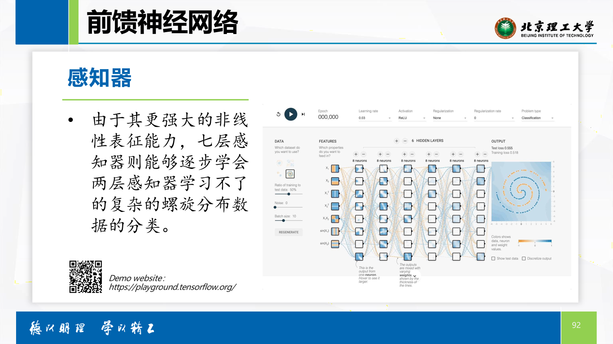
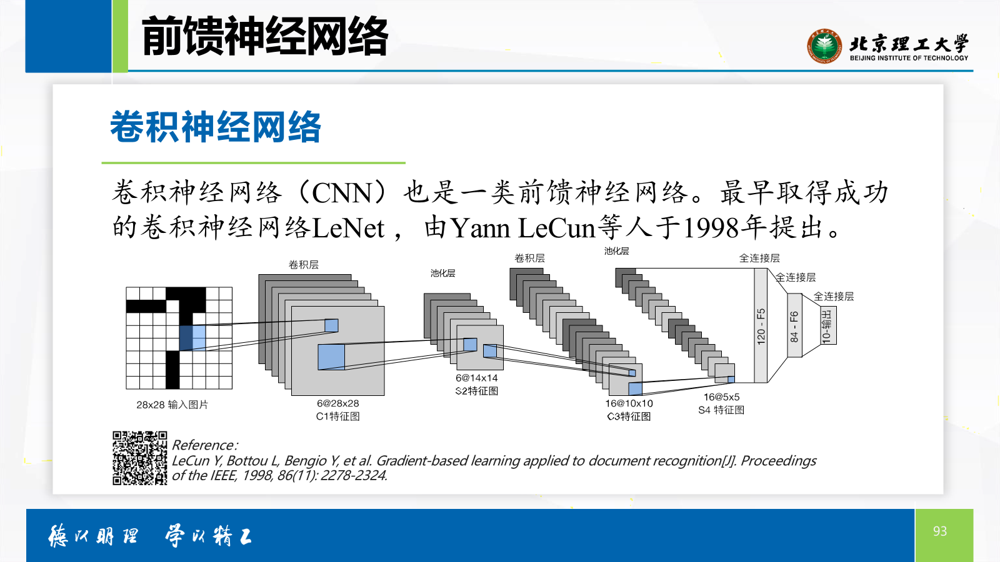
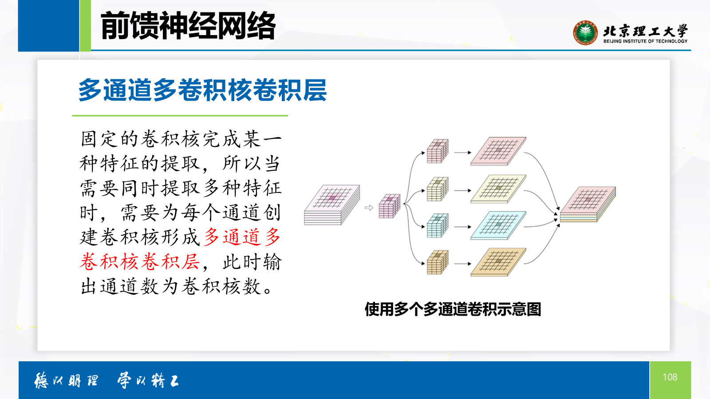
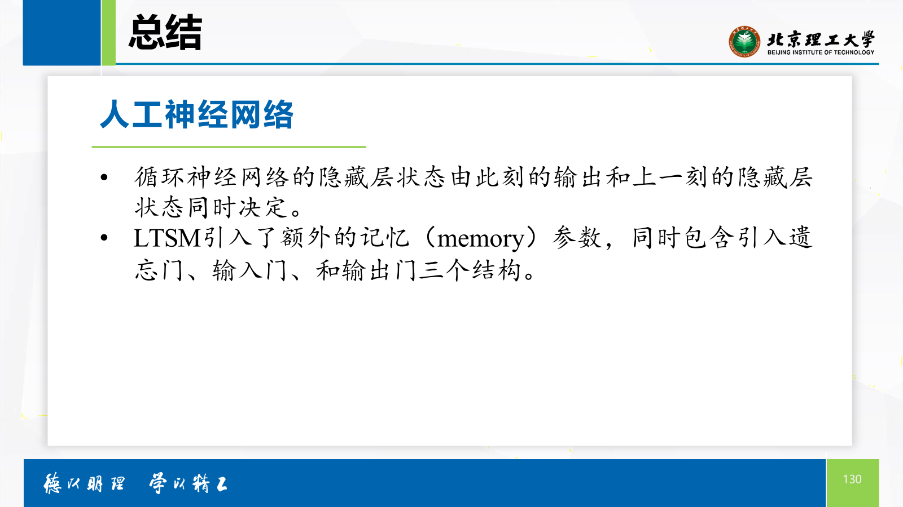

<style>
    body {
        font-size: 13.5px;
        font-family: "Microsoft YaHei", "微软雅黑";
        line-height: 1.6;
    }
</style>

# 六、机器学习与神经网络

<div style="text-align: right; font-style: italic;">by Len Fu 12.11.2024</div>

## 1. 机器学习

机器学习是人工智能的一个分支，它使计算机系统能够从数据中学习，可以识别数据中的模式，并利用这些模式来做出预测或决策。

**分类**


### 1.1 监督学习

监督学习（Supervised Learning）是机器学习中的一种方法，它涉及到从标记的训练数据学习一个模型，并使用该模型对新的、未见过的数据进行预测或决策。在监督学习中，每个训练样本都包括输入特征和一个对应的标签或输出。目标是学习一个映射规则，即模型，它能够根据输入特征准确预测输出标签。


**监督学习分类**

- 分类（Classification）：任务是预测离散的类别标签。例如，判断一封电子邮件是否为垃圾邮件，或者识别图片中的对象是猫还是狗。
    
    

- 回归（Regression）：任务是预测连续的数值。例如，预测房价、股票价格或者明天的天气。

    

**步骤**

监督学习的过程通常包括以下步骤：

1. 数据收集：收集足够的训练数据，这些数据应该包含输入特征和对应的标签。

2. 数据预处理：清洗数据，处理缺失值，进行特征工程等，以提高数据质量。

3. 选择模型：根据问题的性质选择合适的算法，如决策树、支持向量机、神经网络等。

4. 训练模型：使用训练数据来拟合模型，即学习输入特征和输出标签之间的关系。

5. 模型评估：使用验证集或测试集来评估模型的性能，常用的评估指标包括准确率、召回率、F1分数、均方误差等。

6. 参数调优：根据评估结果调整模型参数，以优化模型性能。
模型部署：将训练好的模型部署到生产环境中，对新数据进行预测。

#### 1.1.1 线性回归

核心目标：是寻找一个或多个自变量与因变量之间的线性关系。


##### 核心方法：梯度下降法

**核心概念：残差平方法**


```python
import numpy as np

# Set the original data
x1 = np.array([1, 2, 3, 4, 5])
x2 = np.array([2, 3, 4, 5, 6])
x3 = np.array([3, 4, 5, 6, 7])
y = np.array([2, 4, 6, 8, 10])

# Set original parameters
arg1 = np.ones(5)
arg2 = np.ones(5)
arg3 = np.ones(5)
bia = 0

def RSS(x1, x2, x3, arg1, arg2, arg3, bia):
    return np.sum((y - (arg1 * x1 + arg2 * x2 + arg3 * x3 + bia)) ** 2)

def gradient_descent(x1, x2, x3, arg1, arg2, arg3, bia, learning_rate, iterations):
    for i in range(iterations):
        # Visualization
        print(RSS(x1, x2, x3, arg1, arg2, arg3, bia), iterations)

        # Save the last RSS
        last_RSS = RSS(x1, x2, x3, arg1, arg2, arg3, bia)

        # Back propagation
        arg1 = arg1 - learning_rate * (-2 * last_RSS * x1)
        arg2 = arg2 - learning_rate * (-2 * last_RSS * x2)
        arg3 = arg3 - learning_rate * (-2 * last_RSS * x3)
        bia = bia - learning_rate * (-2 * last_RSS)

# Set the learning rate and iterations
learning_rate = 0.5
iterations = 100

# Run the gradient descent
gradient_descent(x1, x2, x3, arg1, arg2, arg3, bia, learning_rate, iterations)

# Print the result
print(arg1, arg2, arg3, bia)
```

缺陷


##### 过拟合


##### 欠拟合


##### 拟合良好


#### 1.1.2   K-最近邻分类

其核心思想是“近朱者赤，近墨者黑”，即未知样本的类别可以根据距离最近的已知样本来判断。


### 1.2 无监督学习


#### 1.2.1 降维

减少数据的维度，同时尽可能保留重要信息，如主成分分析（PCA）和t-SNE。


##### PCA


#### 1.2.2 聚类 

将数据点分组，使得同一组内的数据点相似度高，不同组之间的数据点相似度低。


##### K-means 


## 2. 神经网络

分类


### 2.1 基本概念

人工神经网络（artificial neural network，ANNs），简称神经网络（neural network，NNs），是一种模仿生物神经网络（例如大脑）的结构和功能的计算模型。

#### 2.1.1 人工神经元

人工神经元同样也是对生物神经元的模仿。

生物神经元结构包括：树突、细胞体、轴突等。

这些结构可以大致对应人工神经元中的：加权输入，求和，输出激活值。

单个生物神经元的工作方式可以想象成一个小开关，它在接收到足够多的信号后才会激活。

类似地，人工神经元收到的加权输入足够大才会激活。


##### 输入


##### 权重


##### 加权求和


##### 偏置


##### 激活函数


后者与生物神经元更相近。

##### 输出端 


##### 学习的目标：损失函数


##### 学习的方法：梯度下降法


### 2.2 前馈神经网络

前馈神经网络（Feedforward Neural Network，FNN）是一种基础的人工神经网络结构，其信息流动是单向的，从输入层（Input Layer）经过一个或多个隐藏层（Hidden Layers）最终到达输出层（Output Layer）。各神经元之间不存在反馈。

#### 2.2.1 感知器


单层感知器可以轻松感知线性可分的分类问题，但面对复杂的非线性可分问题，这时候需要多层感知器（多个单层感知器）来实现非线性分类。


再复杂，再增加层数。



#### 2.2.2 卷积神经网络



##### 卷积层


###### 卷积层输出尺寸的计算

<div style="color: red; text-align: center ;">
假设图像的宽度为𝑊，高度为𝐻，卷积核宽和高均为𝑘，则：

输出的特征图宽度为𝑊 − 𝑘 + 1
输出特征图的高度为𝐻 − 𝑘 + 1</div>


###### 问题

随着卷积的进行，信息越来越集中，图像的边缘信息丢失。用填充来解决这一问题。

###### 填充


###### 填充后输出的尺寸

<div style="color: red; text-align: center ;">
假设图像矩阵为𝑊×𝐻	，卷积核为𝑘 ×𝑘	，若在宽和高的单侧均填充𝑃 个像素点，则输出特征图的大小为

(𝑊 + 2𝑃 − 𝑘 + 1，𝐻 + 2𝑃 − 𝑘 + 1)
</div>


###### 步幅


###### 带步幅的输出尺寸


###### 多通道卷积层




##### 池化层

卷积层提取的特征在空间上往往比较冗余，池化（pooling）的目的是	对提取特征的简化。
例如步幅为2，窗口大小为2的池化层可以对特征进行2倍下采样。


###### 平均值池化


###### 最大值池化


##### 全连接层


### 2.3 后馈神经网络

反馈神经网络在输出层到输入层存在反馈，即每一个输入节点都有可能接受来自外部的输入和来自输出神经元的反馈。

#### 2.3.1 循环神经网络


####  2.3.2 长短时记忆网络


## 3. 总结





