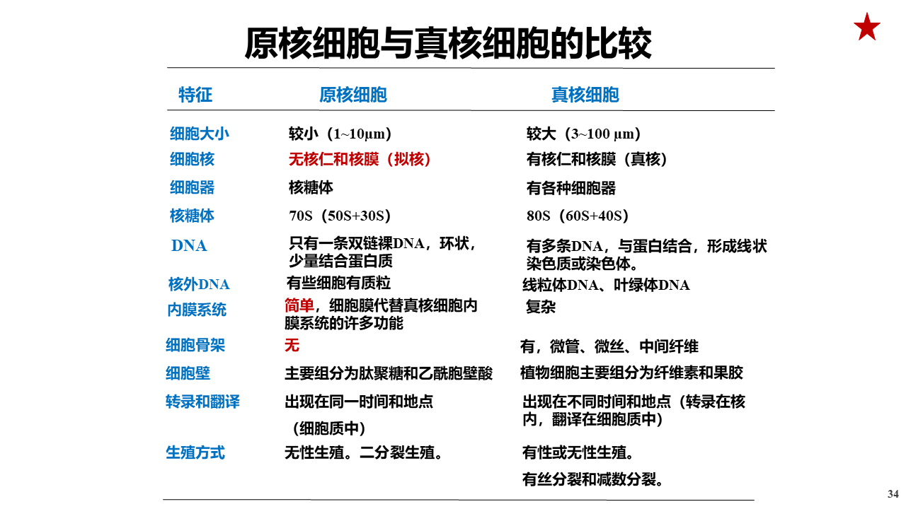

# 原核细胞和真核细胞的比较
- 

# 原核细胞

## 细菌
- 0.1-10um
- 细胞膜
- 细胞壁
    - 肽聚糖
        - 溶菌酶：破坏肽聚糖结构
        - 青霉素: 抑制肽聚糖合成
            革兰氏阳阴氏菌：
            - G-：细胞壁薄，肽聚糖薄，青霉素不敏感
            - G+：细胞壁厚，敏感
- 核糖体：
    - 小亚基：四环素、链霉素敏感
    - 大亚基：红霉素、氯霉素敏感
- 质粒
- 荚膜

## 放线菌
- G+

## 蓝细菌

## 支原体
- 细胞外生存最小微生物
- 无细胞壁，青霉素不敏感
- 大环内酯类敏感
- 可通过滤菌膜

## 衣原体和立克次氏体
- 都有DNA\RNA，细胞壁
- 酶系统不完整，不能合成ATP\GTP
- 前者可通过滤菌膜
- 后者不可以
