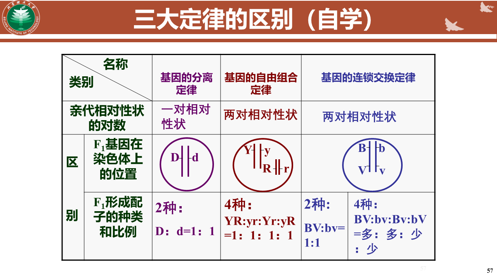

## 5.2.遗传、基因与染色体
##### 等位基因的概念
同源染色体的相同位置上控制着某一相对性状的一对基因
- 复等位基因
- 拟等位基因
#### 遗传学三大基本定律

##### 分离定律
非同源染色体上的非等位基因的自由组合
##### 自由组合定律
非同源染色体上的非等位基因的自由组合
##### 基因的连锁和交换定律
- 连锁
	同一条染色体的不同基因总是一起进入配子
		位置越近越容易发生连锁
- 交换
	同源染色体上的等位基因发生交换