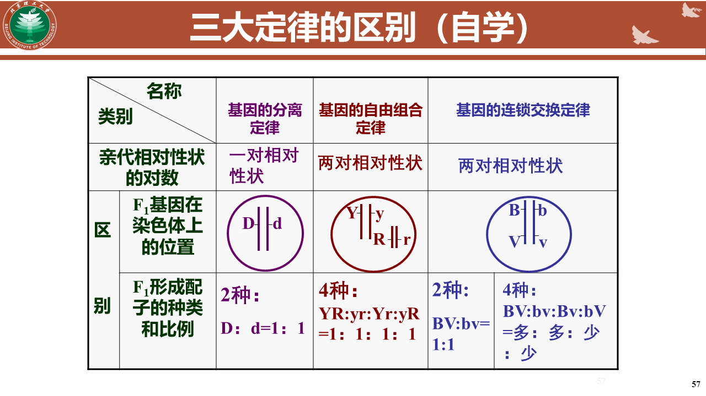
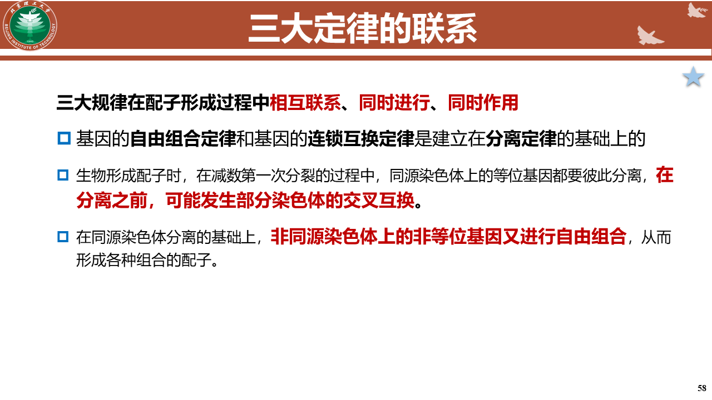

## 
## 5.2.遗传、基因与染色体
##### 等位基因的概念
同源染色体的相同位置上控制着某一相对性状的一对基因
- 复等位基因
- 拟等位基因
#### 遗传学三大基本定律

##### 分离定律
非同源染色体上的非等位基因的自由组合
##### 自由组合定律
非同源染色体上的非等位基因的自由组合
##### 基因的连锁和交换定律
- 连锁
	同一条染色体的不同基因总是一起进入配子
		位置越近越容易发生连锁
- 交换
	同源染色体上的等位基因发生交换

## 5.3 DNA与遗传
- DNA双螺旋结构要点和生物学意义：
    - DNA双螺旋结构由两条互补的核苷酸链组成，它们围绕一个中心轴以螺旋形式排列。
    - 每条链上的核苷酸通过磷酸二酯键连接，形成DNA的主链。
    - 碱基（腺嘌呤A、胸腺嘧啶T、鸟嘌呤G、胞嘧啶C）通过氢键在两条链之间配对，遵循A-T和G-C的配对规则。
    - 这种结构的生物学意义在于，它提供了一种稳定且可复制的遗传信息存储方式，同时允许遗传信息的精确传递和表达。
- DNA的复制过程，RNA引物、先导链、冈崎片段的概念：

    - DNA复制是一个半保留过程，每个新DNA分子包含一条原始链和一条新合成的链。
    - RNA引物是一段短的RNA序列，由DNA聚合酶在复制起始点合成，为DNA链的合成提供起始点。
    - 先导链是连续合成的DNA链，与复制叉的移动方向相同。
    - 冈崎片段是在滞后链上由DNA聚合酶合成的短DNA片段，这些片段在复制过程中被合成，然后连接起来形成完整的滞后链。
- 端粒和端粒酶的概念，端粒的复制方式：
    - 端粒是位于染色体末端的重复核苷酸序列，保护染色体免受退化和错误地与其他DNA序列融合。
    - 端粒酶是一种逆转录酶，它能够延长端粒，通过添加特定的重复序列来抵消每次细胞分裂时端粒缩短的现象。
    - 端粒的复制方式涉及到端粒酶的作用，它在细胞分裂过程中保持染色体的完整性。
- 聚合酶链反应(PCR)的过程和原理：
    - PCR是一种在体外复制特定DNA片段的技术，它包括三个主要步骤：变性、退火和延伸。
    - 变性：DNA双链在高温下被解开，形成单链。
    - 退火：温度降低后，引物与DNA的互补序列结合。
    - 延伸：DNA聚合酶沿着单链DNA合成新的互补链。
    - 这个过程在一系列循环中重复进行，每个循环都会使目标DNA片段的数量翻倍，从而实现快速扩增。
## 5.5
##### 乳糖操纵子
- 乳糖操纵子（Lac operon）是大肠杆菌中调控乳糖代谢基因表达的一个经典例子。它包括一组基因（lacZ、lacY、lacA），这些基因编码的酶参与乳糖的代谢。
- 当细胞中乳糖浓度高时，乳糖操纵子被激活，允许乳糖被转化为葡萄糖和半乳糖，这些糖可以被细胞用作能量来源。
- 乳糖操纵子的意义在于它展示了基因表达如何响应环境变化，以及如何通过调控机制来优化资源利用。

##### RNA干扰
- RNA干扰（RNAi）是一种基因沉默现象，其中小RNA分子（如siRNA或miRNA）通过与目标mRNA的互补序列结合，导致mRNA的降解或抑制其翻译，从而降低特定基因的表达水平。
- RNA干扰在生物体中具有重要的调控作用，包括基因表达的调控、抗病毒防御以及抑制移动遗传元件（如转座子）的活动。
- RNAi技术也被广泛应用于研究基因功能和作为治疗某些疾病的潜在手段。