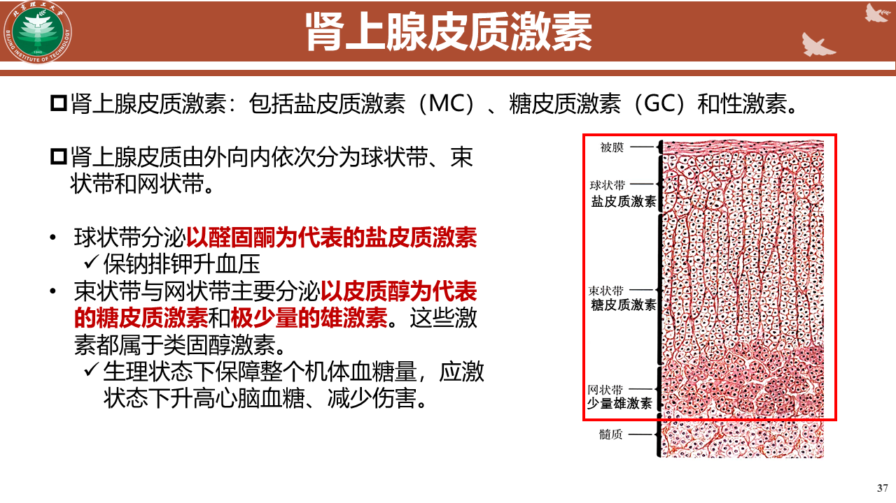
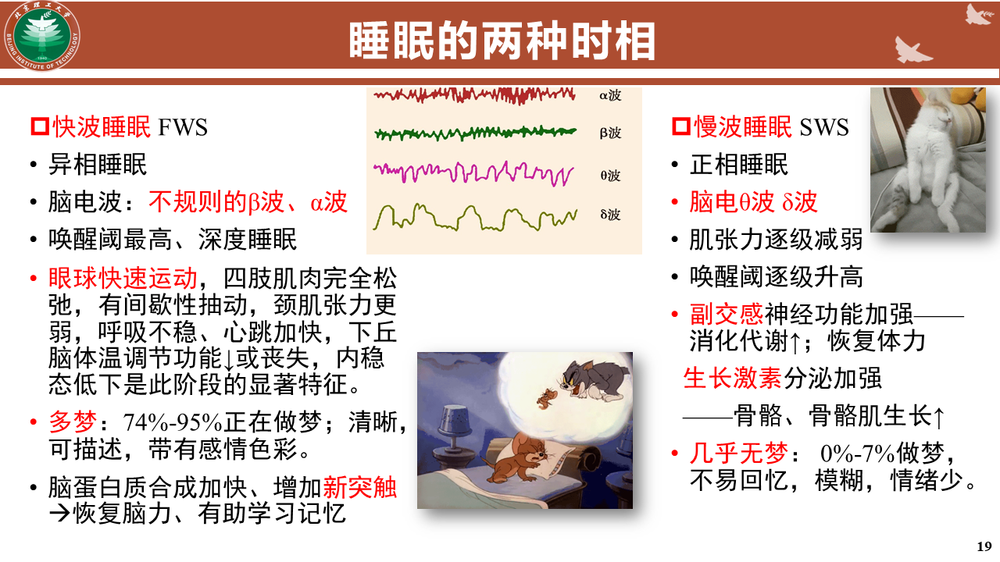

### 组织
##### 上皮组织
- 覆盖在身体表面和有腔器官内表面的膜状的紧密排列的细胞。
- 保护、分泌、排泄和吸收
- 腺体也是上皮组织
##### 肌组织
- 由成束的具有收缩功能的肌细胞构成
- 骨骼肌、心肌和平滑肌
##### 神经组织
- 神经细胞（传递神经信号）和神经胶质细胞（保护、支持、营养神经元的作用）组成。
- 主管信息的接受、传递、储存和分析。
##### 结缔组织
- 由细胞和大量细胞外基质构成。
- 包括无定形的基质、细丝状的纤维和不断循环更新的组织液。
- 连接、支持、保护、防御、修复和运输的功能。
- 巩膜肌腱、关节韧带、皮肤真皮层、血液、骨、软骨、脂肪
### 器官
由多种组织构成的特定形态结构，完成与其形态特征相适应的生理功能。
### 系统
在功能上相关联的一些器官联合在一起，分工合作完成生命必须的某种功能的结构单元
**九大系统**
    - 运动系统
    - 神经系统
    - 内分泌系统
    - 循环系统
    - 免疫系统
    - 呼吸系统
    - 消化系统
    - 泌尿系统
    - 生殖系统

### 繁殖
生物为延续种族所进行的产生后代的生理过程，即生物产生新的个体的过程。
##### 无性繁殖
- 分裂、孢子、出芽、营养生殖。
- 离体植物组织培养
- 动物的克隆
##### 有性繁殖
- 性细胞结合而发育成一个新个体。

### 发育
**过程**
1. 受精
2. 着床
3. 胚胎形成
    - 卵裂
    - 囊胚

### 内分泌系统
由机体内分泌腺和内分泌组织构成的信息传递系统
- 激素：内分泌细胞合成和分泌的，以体液为媒介，在细胞之间递送调节信息的高效能生物活性物质
    - 内分泌
    - 内在分泌
    - 神经分泌
    - 自分泌
    - 旁分泌
#### 神经内分泌系统
**神经内分泌细胞**
    既具有神经功能，又具有内分泌功能，它们的活动称为神经分泌，分泌神经激素。
    - 下丘脑-腺垂体
        之间没有直接的神经结构联系，存在特殊的血管网络。
        合成、分泌
        - 下丘脑调节肽
        - 腺垂体激素
            - 生长激素、催乳素
            - 促甲状腺激素、促肾上腺皮质素、卵泡刺激素和黄体生成素：垂体促激素
    - 下丘脑-神经垂体
        神经垂体不含腺细胞，储存下丘脑分泌的激素，并释放
    - 松果体
        褪黑素
#### 胰岛
##### 五种细胞
- B细胞
- A细胞：胰高血糖素
- D细胞：生长抑素
- H细胞和PP细胞：血管活性肠肽
##### 胰岛素
- 二硫键两个，在AB间
**生物学功能**
- 促进脂肪的合成和储存
- 促进蛋白质的合成与储存
- 促进K,MG及磷酸盐进入细胞
- 与生长激素具有协同作用
##### 胰高血糖素
- 促进B细胞D细胞

#### 肾上腺皮质激素

#### 肾上腺髓质激素
肾上腺素和去甲肾上腺素

### 神经系统
##### 内脏神经
分布于内脏平滑肌、心血管、腺体的神经
##### 神经胶质细胞
- 参与形成血脑屏障
- 促进神经元再生与修复
##### 睡眠

