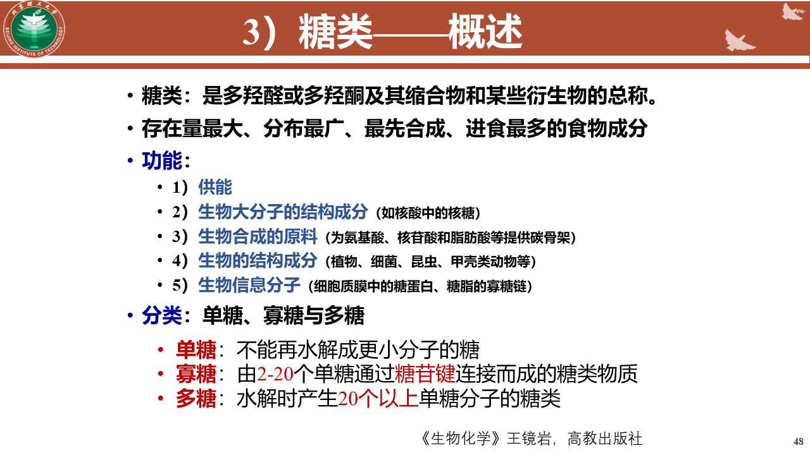
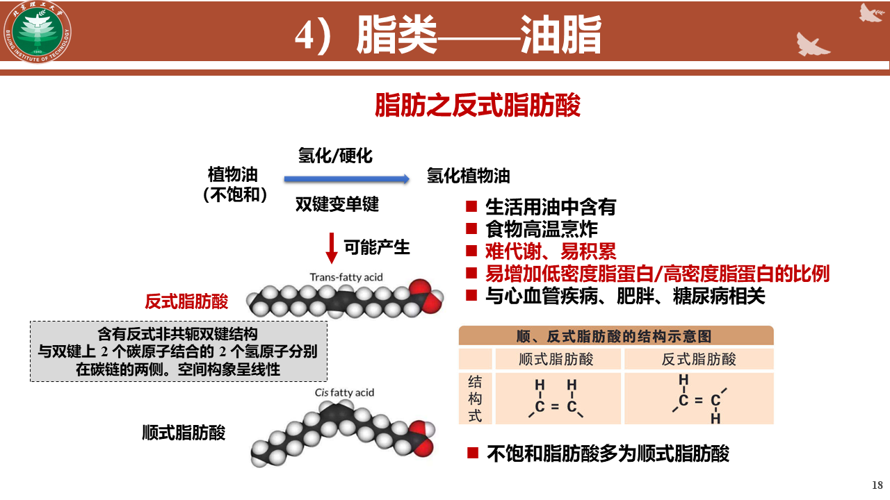
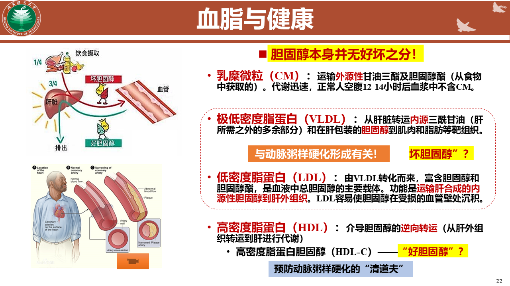
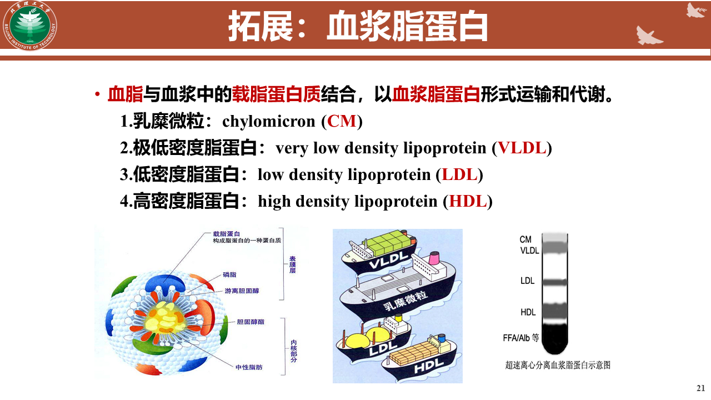

# 预期学习目标

## 生命本质

### 生命的本质是元素

- 生命的本质是元素，因为所有生命体都是由基本的化学元素构成的。这些元素包括碳、氢、氧、氮、磷、硫等，它们通过不同的化学键结合形成各种生物分子，如蛋白质、核酸、脂质和碳水化合物。这些分子进一步组成细胞，细胞是生命的基本单位。生命体的遗传信息、代谢过程、结构和功能都依赖于这些元素的特定排列和组合。
### 生命的三大关键特征

- 新陈代谢：生命体能够通过一系列化学反应来获取能量和合成所需的分子。例如，通过光合作用，植物能够将太阳能转化为化学能，并通过呼吸作用释放能量。
- 自我复制：生命体能够复制自己的遗传物质，确保遗传信息的传递。例如，DNA通过复制过程在细胞分裂时传递给子细胞。
- 适应性：生命体能够对环境变化做出反应，以提高生存和繁衍的机会。例如，某些细菌能够通过基因突变产生抗生素抗性，从而在抗生素存在的环境中生存下来。

## 三主干六界

- 真核生物
	- 原生生物界：单细胞的原生生物
	- 动物界
	- 植物界
	- 真菌界
- 古菌界
- 真细菌界

## 生命的基本化学组成

### 生命体对自然界元素摄取的选择性

### 根据含量分类元素

- 常量元素（0.01%）：OCHN,CA,P,K,S,NA
- 微量元素（<0.01%）:FE\ZN\CU\MN\ISEF\CR

### 生命体对自然界元素摄取的选择性
- 锌是许多酶的辅助因子，参与DNA复制和细胞分裂
- 铜参与铁的吸收和利用，以及抗氧化酶的活性。

### 水
- 溶剂作用：水是细胞内许多生化反应的介质。
- 结构成分：水分子参与细胞结构的构建，如细胞膜。
- 温度调节：水的高比热容使其成为调节体温的重要物质。
- 运输介质：水帮助营养物质和废物在细胞内外的运输。

## 生物大分子

### 蛋白质
- 蛋白质常数：6.25
- 蛋白质功能分类
- 蛋白质构件分子的结构和功能特点
- 蛋白质一级~~四级结构的本质及生物学意义
	- 1：共价键：肽键、二硫键
	- 2：氢键
	- 3：氢键，离子键，疏水键
	- 4：次级键
- 蛋白质变性
	- 一定浓度的尿素
	- 非共价键不断裂
	- 空间构象破坏
	- 蛋白质溶解度下降
	- 不可逆
	- 更容易被水解
- 蛋白质变构
	- 构象改变，功能改变
	- 可逆
- 蛋白质机器
	- 大量蛋白质和生物分子形成的高维度的、复杂的超级功能复合体
	- 由多个蛋白质亚基组成的复合体，它们协同工作以执行特定的生物学功能。
	- 比如APT核酶、核糖体 细胞骨架
### 核酸
- 核苷酸的功能、结构和种类
- DNA的一二级结构
	- 1：脱氧核苷酸排列顺序
	- 2：双螺旋结构
- RNA的基本结构
	- 三维结构
- 核酸的应用
	- 变性：非共价键破坏，变成单链
	- 复性：单链变双链
	- 分子杂交：不同来源的核酸变性后，只要它们存在大致相同的碱基互补配对序列，就可以形成杂化双链
	- 核酶：催化活性的RNA，切割RNA\DNA，（RNA连接酶、磷酸酶活性）、参与RNA自身剪切和加工过程
	- 非编码RNA：起调控作用

### 糖类
- 
- 主要作用
	- 能量来源：如葡萄糖，是细胞的主要能量来源。
	- 结构成分：如纤维素，是植物细胞壁的主要成分。
	- 信息传递：如糖蛋白，参与细胞识别和信号传递。
	- 储存形式：如淀粉和糖原，分别在植物和动物体内储存能量。
- 多糖
	- 氨基聚糖： 动物和细菌有，重复的双糖单位，细胞抗压，透明质酸：HA，肝素
	- 蛋白聚糖：核心蛋白加氨基聚糖

### 脂类
- 脂类与糖类的性质差异
	- 疏水
- 油脂的结构和功能
	- 饱和：无双键；不饱和：有双键
	- 顺反式脂肪酸：
- 类固醇：
	- 一类具有四个环状结构的脂类，包括一个环戊烷环和一个环己烷环
	- 胆固醇：
		- 细胞膜成分之一
		- 激素前体
		- 胆汁成分之一
	- 血浆脂蛋白：
		- 
		- 

# 生物的化学基础

## 生命的基本化学组成

### 元素

- 没有一种化学元素是生命所特有的，生物界和非生物界具有统一性

### 含量分类

- 常量元素

	- 主要元素

		- C H O N

	- S P Cl Ca KNa Mg

- 微量元素

	- 铁 铜 钴 锌 锰 铬

### 重要元素

- 钙

	- 构成骨骼和牙齿的主要成分

- 磷

	- 骨骼和牙齿的组成部分

- 铁

	- 血红蛋白

- 锌

	- 体内多种酶的活性有关

### 同位素

- 生物体无差别吸收含有放射性同位素的化合物

### 水

- 极性分子且可形成氢键

	- 产生水分子的黏着力

		- 较强的内聚力和表面张力

			- 毛细现象和吸附现象（土壤，植物中的导管）

	- 使水具备较大的抵抗温度变化的能力

	- 冰中氢键稀疏，密度比水小，冰浮在水上

		- 将水下与冷的环境隔离开来，更好的保护水下生命的正常生命活动

	- 水是生命的溶剂

- 是溶剂，化学反应的原料，提供液体环境

## 生物大分子

### 小分子物质聚合生物大分子，生物大分子分解成小分子物质

## 糖类

### 功能

- 供能

- 生物大分子中的结构成分

- 生物合成的原料

- 生物的结构成分

- 生物分子信息

### 分类

- 单糖

- 寡糖

	- 重要的信息物质

- 多糖

### 膳食纤维

- 纤维素

- 果胶

## 核酸

### 功能

- DNA

	- 染色体成分，储藏、传递遗传信息

- RNA

	- 实现遗传信息在蛋白质的表达，是遗传信息向表型转化的桥梁

### 由核苷酸单体相连而成

### DNA结构

- 一级结构

	- 碱基排列顺序

- 二级结构

	- 依碱基互补原则形成的双螺旋结构

### RNA结构

- 能形成发夹结构

### 应用

- 核酸的变性和复性

	- 指非共价键的破坏

	- 温度缓慢冷却才可复性

	- 骤降不可

- 核酸的分子杂交

	- 只要存在大致相同的碱基互补配对序列，就可以形成杂化双链

	- 用放射性同位素标记一个寡核苷酸，探针

- 核酶

	- 催化活性的RNA

	- 功能

		- 切割RNADNA，RNA连接酶，磷酸酶活性，参与RNA自身剪切和加工过程

	- 特性

		- 催化效率低，有特异性

- 非编码RNA

	- 不编码蛋白质，起调控作用

## 蛋白质

### 蛋白质常数

- 1g氮==6.25蛋白质

### 功能分类

- 结构蛋白

	- 支持作用

- 贮藏蛋白

	- 提供氨基酸

- 收缩蛋白

	- 肌肉

- 转运蛋白

- 防卫蛋白

- 信号蛋白

- 酶

### 结构

- 结构单体

	- alpha-氨基酸

- 基本结构

	- 肽键与肽

		- alpha氨基与相邻的alpha羧基脱水，以酰胺健的形式

- 多级空间结构

	- 包括一级到四级结构

		- 一级结构

			- 多肽链的氨基酸的排列顺序

		- 二级结构

			- 氢键

		- 三级结构

			- 氢键，离子键，疏水键

		- 四级结构

			- 次级键

				- 不同亚基间相互作用形成的具有功能的蛋白质复合分子

- 变性

	- 条件

		- 高温，紫外线，强酸，强碱，一定浓度的尿素

	- 空间构想被破坏

		- 非共价键破坏，不涉及肽键和二硫键的破坏

	- 溶解度下降

	- 一般不可逆

	- 更易被蛋白酶水解

- 变构

	- 蛋白质构象的变化

	- 可逆

- 蛋白质机器

	- 由大量蛋白质和生物分子形成的高纬度，复杂的超级功能复合体

## 脂质

### 不溶于水，高溶于非极性溶剂

### 油脂

- 油和脂肪的统称

- 甘油三脂

- 饱和

	- 无双键

- 不饱和

	- 有双键

- 反式脂肪酸

### 类固醇

- 胆固醇

	- 功能

		- 胆汁的成分之一

		- 激素的前体物质

		- 构成细胞膜的成分

	- 分类

		- 低密度脂蛋白

			- 动脉粥样硬化有关

		- 高密度脂蛋白

			- 介导胆固醇从肝外组织转运到肝进行代谢

