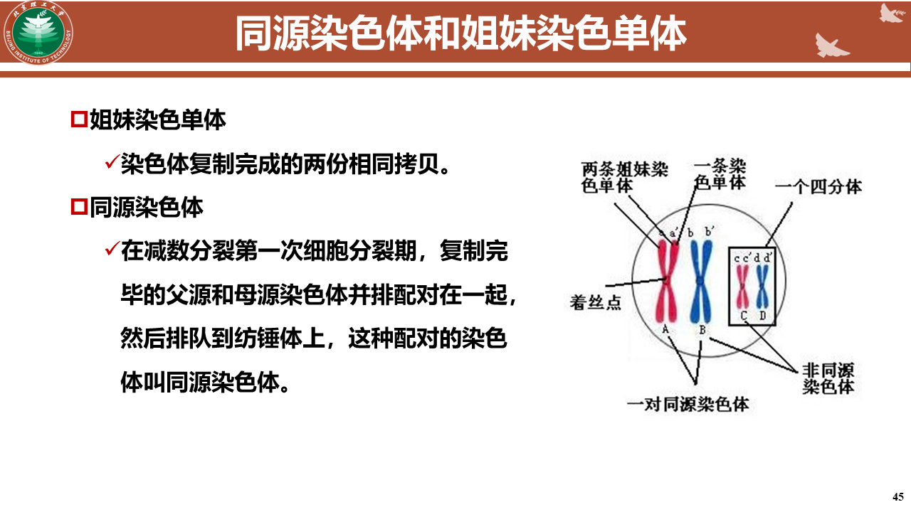
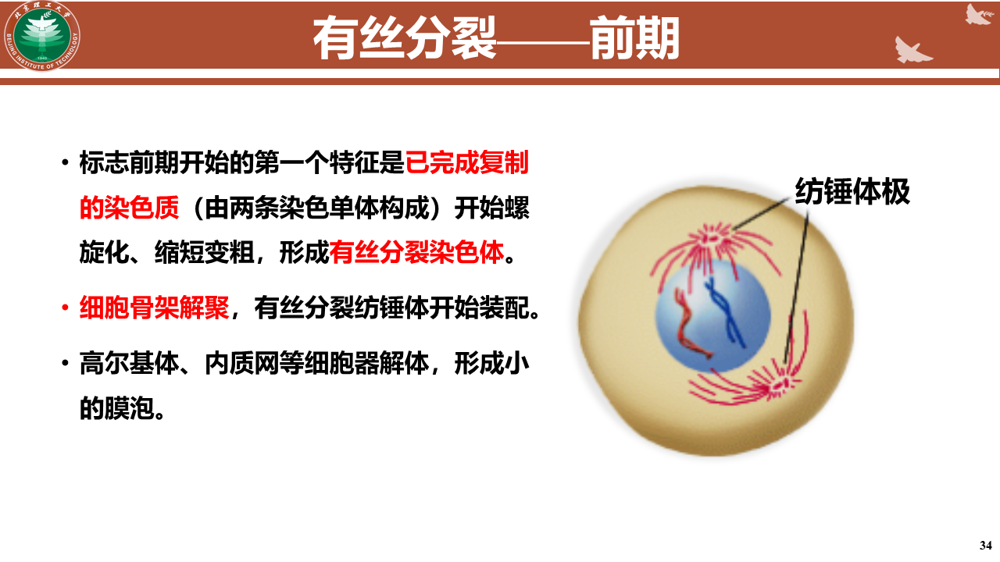
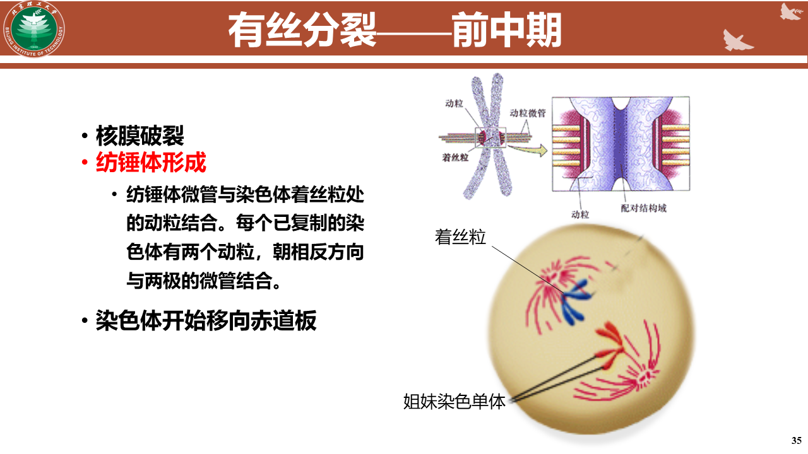
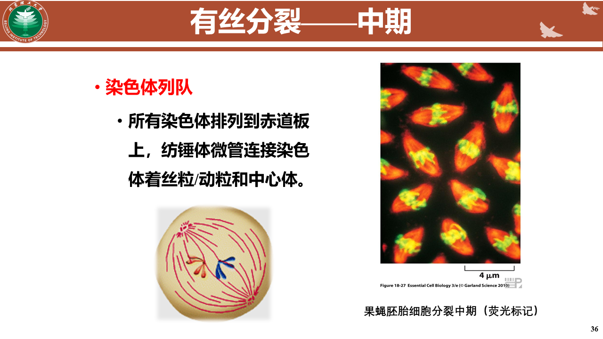
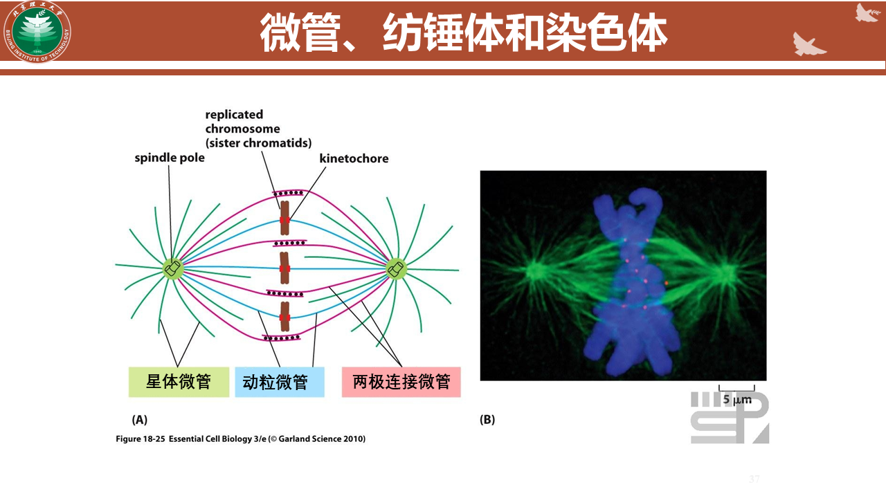
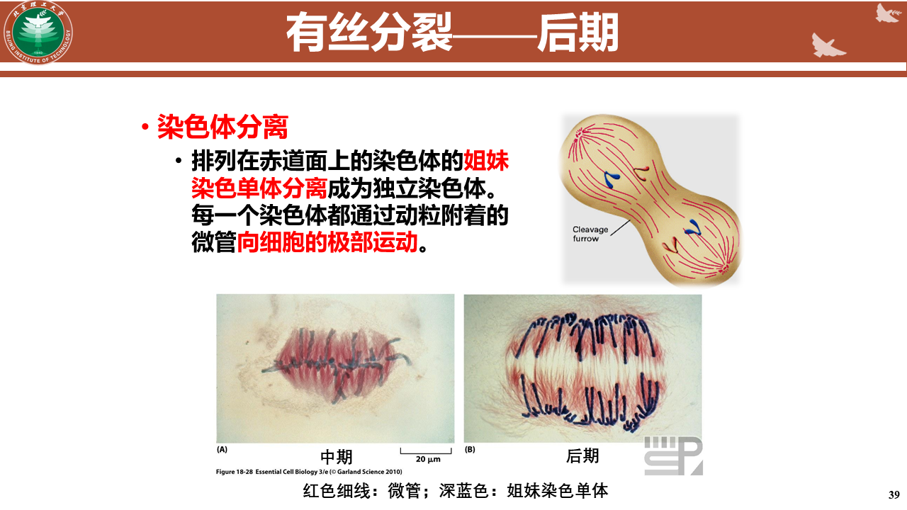
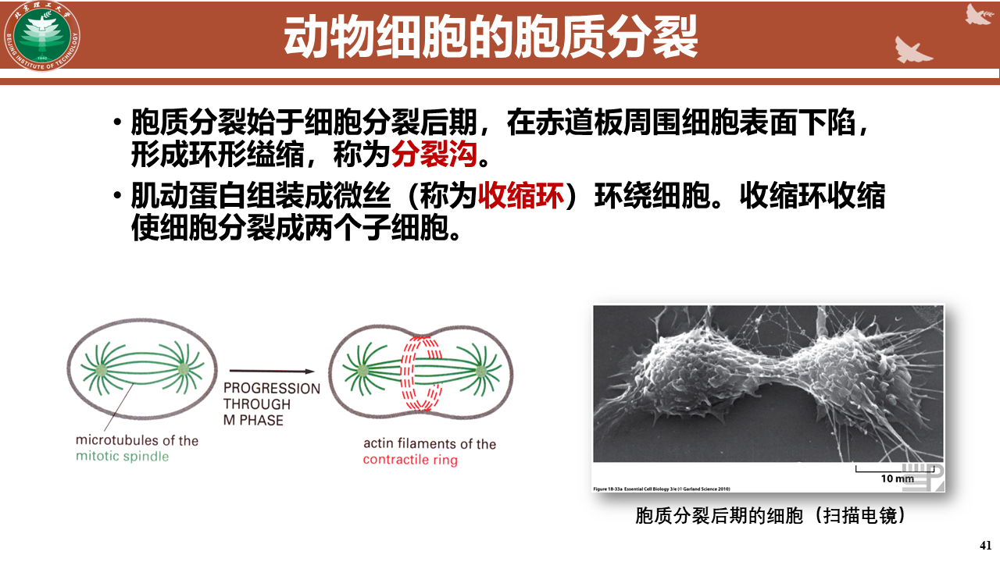
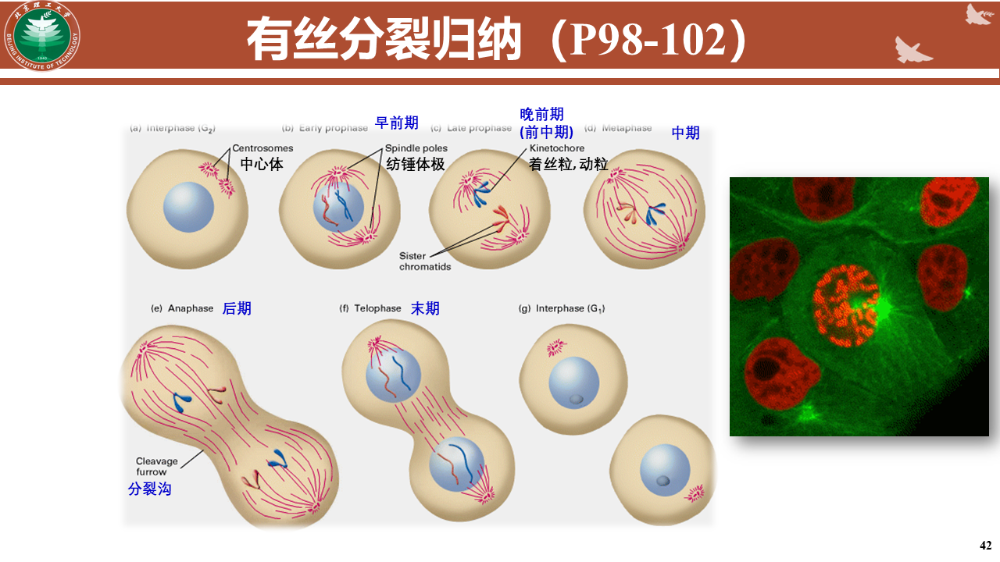
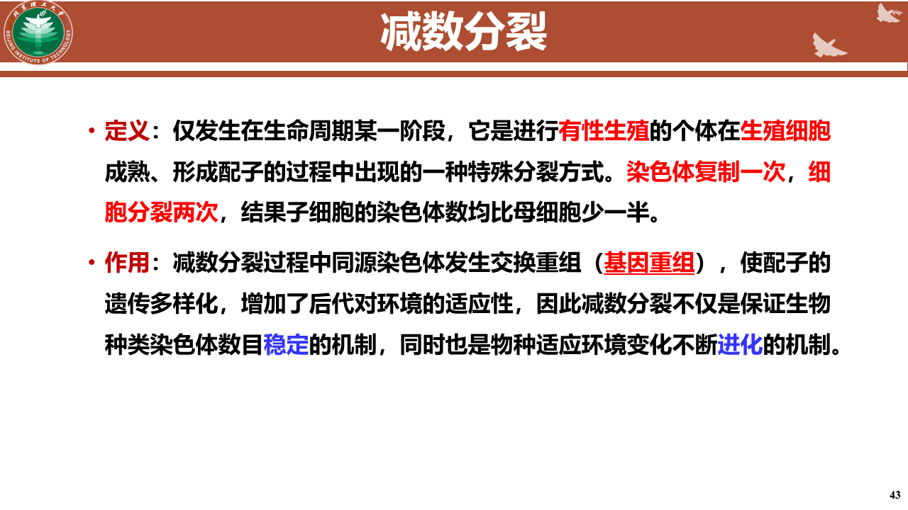
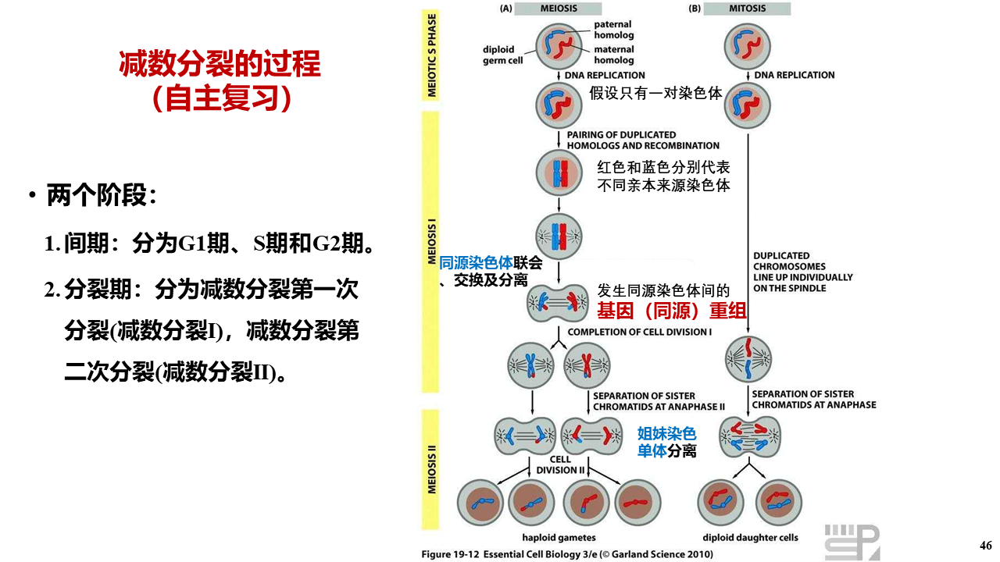

# 细胞周期与细胞分裂
### 调控的机制
细胞周期蛋白和细胞周期蛋白依赖性激酶是驱动细胞周期运转的引擎。
- Cyclin-CDK复合体控制和协调细胞周期进程
    ***磷酸化修饰后方具活性***
- cyclins
    细胞周期蛋白
        **调节亚基**
- CDKs
    细胞周期蛋白依赖性激酶
        **催化亚基**

- 可逆共价修饰
    蛋白质的磷酸化（蛋白激酶催化）和非磷酸化（蛋白磷酸酶催化）
- 本质上说：肿瘤的产生是丧失细胞周期调控机能的结果

### 细胞周期
- 概念
    - G1
        合成前期，细胞物质的积累，RNA和蛋白质的合成
    - S
        DNA合成期
    - G2
        合成后期，大量合成ATP\RNA\蛋白质
    - M
        分裂期
    - 从上一次细胞分裂结束，到下一次细胞分裂结束这一时间段
    - 细胞周期是高度组织和严格调控的连续过程
- 不同分裂行为的细胞类群
    - G0期：成体的绝大部分细胞不分裂，除非有诱，    
        T淋巴细胞、肝细胞
    - 持续分裂细胞：具有正常细胞周期的持续分裂细胞
        造血干细胞
    - 终端分化细胞：永久性失去了分裂的能力，高度特化
        哺乳动物红细胞、神经细胞、肌细胞
## 细胞分裂
一个细胞分裂成两个细胞的进程
**根据分裂期细胞是否出现纺锤丝、染色质及染色体行为分类**
    - 无丝分裂
    - 有丝分裂
    微管、纺锤体、染色体
    - 减数分裂:维持种族遗传稳定
        染色体复制一次，细胞分裂两次
        同源染色体联会
        基因重组

**姐妹、同源的辨析**

#### 有丝分裂

**注意是微管**

**动物细胞的胞质分裂**

#### 减数分裂

