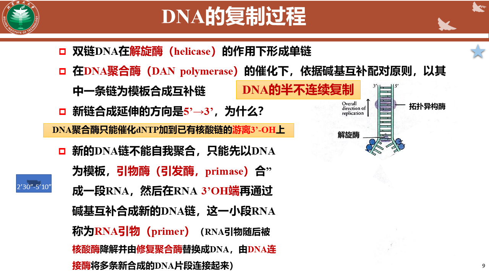
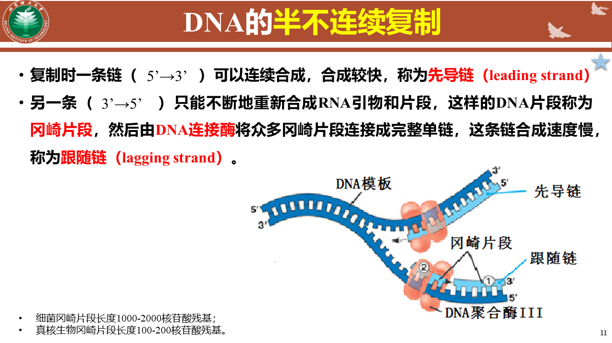
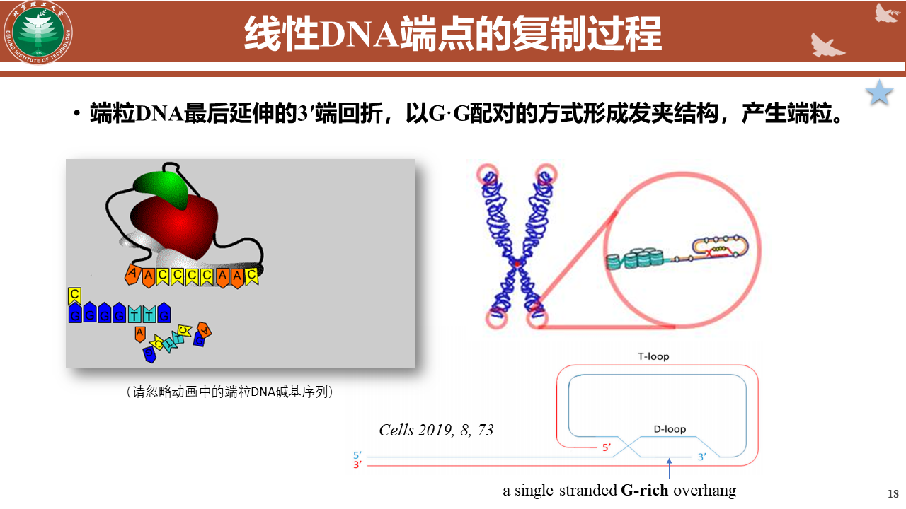
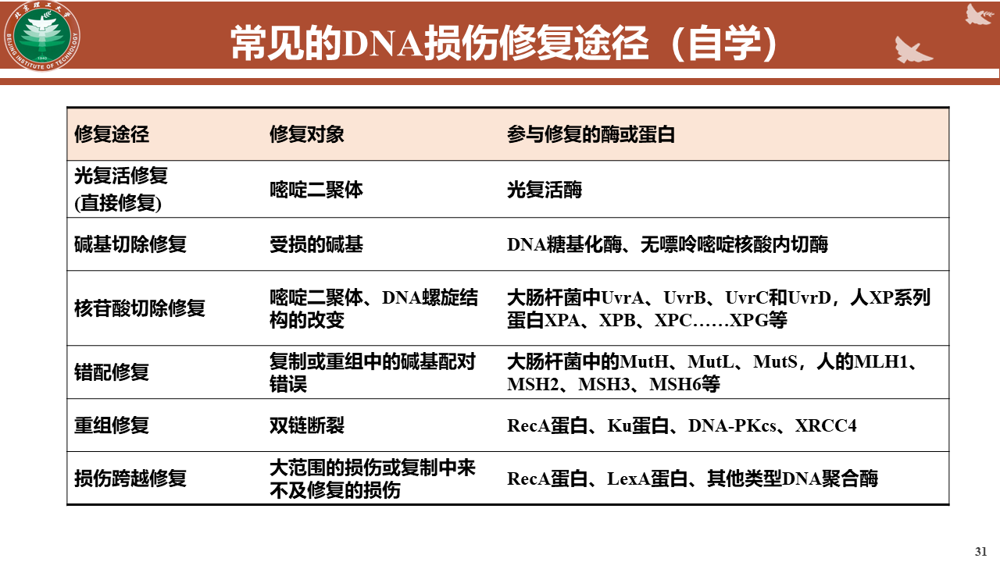
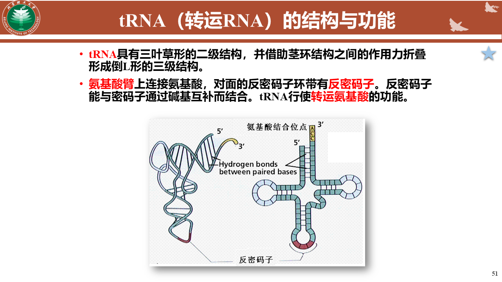
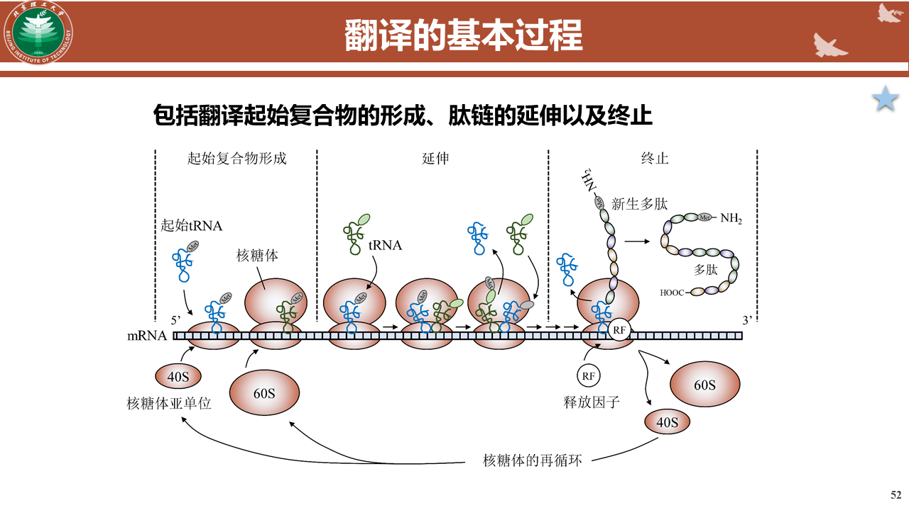
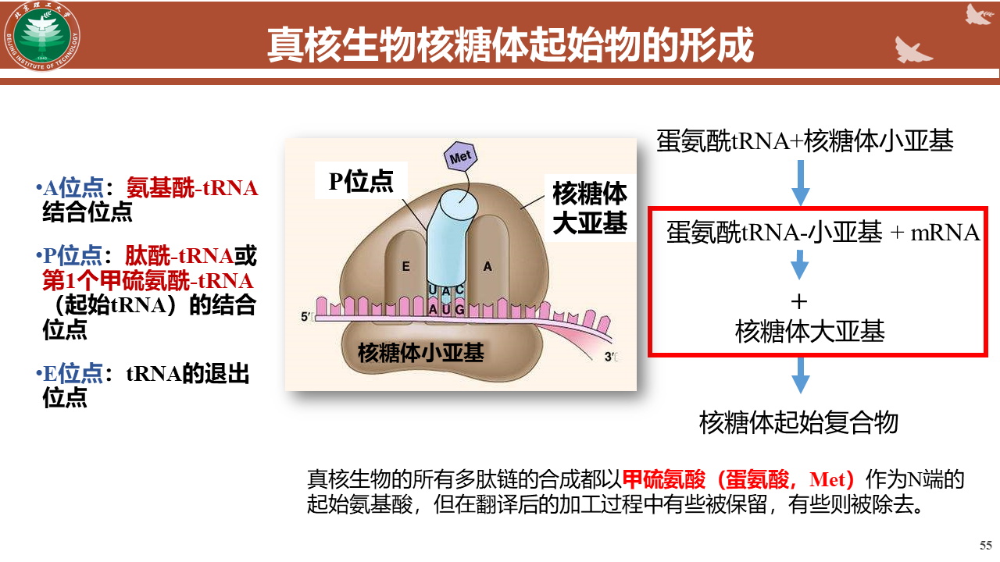
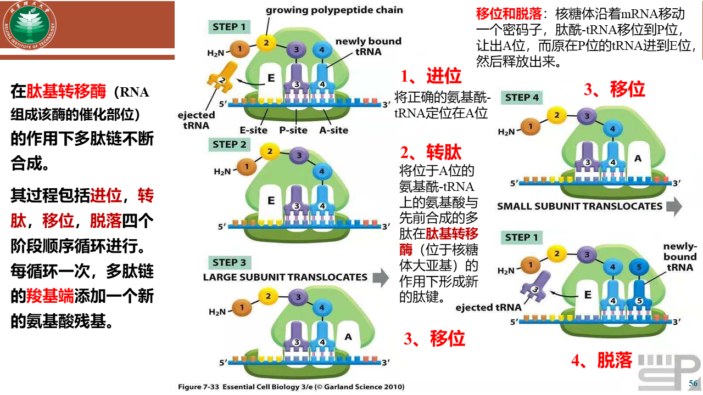
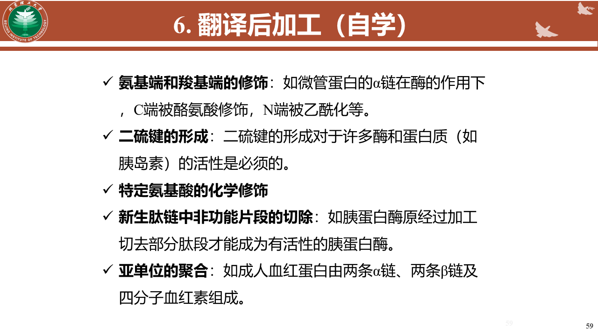

# DNA与遗传

### 双螺旋结构与特点
- 两条反向平行的多脱氧核苷酸链围绕同一中心轴缠绕，形成一个双螺旋结构，两条链间形成碱基配对
- 脱氧核糖和磷酸基团骨架位于双螺旋的外侧，疏水性的碱基在内侧
- 一圈大概10个碱基
- 大沟小沟：大沟暴露给与DNA结合的特殊蛋白质

### DNA复制的机制
***半保留复制***
    其中每个新合成的DNA双螺旋分子包含一条原始链和一条新合成的互补链，确保遗传信息的准确传递。
- 多起点双向复制
**DNA的复制过程**
- 解旋酶
- DNA聚合酶
- RNA引物：由引物酶合成的一段RNA

**DNA的半不连续复制**
- 先导链：连续合成的DNA链，与复制叉的移动方向相同
- 冈崎片段：冈崎片段是在滞后链上由DNA聚合酶合成的短DNA片段
- DNA连接酶
- 跟随链

**DNA的复制条件**
1. 模板
2. 原料
3. 酶
4. RNA引物

**解决DNA复制的5'空缺问题——端粒DNA**
- 端粒：端粒是位于染色体末端的重复核苷酸序列，保护染色体免受退化和错误地与其他DNA序列融合。
- 端粒酶：含有RNA的酶，合成端粒DNA，特殊的逆转录酶

**端粒、端粒酶和端粒的复制方式**

### PCR
- 针对特定的DNA片段在体外进行的快乐扩增技术
**基本步骤**
1. 变性：95℃
2. 退火：形成部分双链,37-55℃
3. 延伸: 72℃，在pfu酶的作用下，开始以四种脱氧核苷酸为原料合成DNA新链

### DNA的损伤修复

# 基因的表达

### 中心法则
是指遗传信息从DNA传递给RNA，再从RNA传递给蛋白质，即完成遗传信息的转录和翻译的过程。

### 基因表达
DNA序列所蕴藏的遗传信息，通过转录和翻译形成具有生物活性的蛋白质，这个过程称为基因表达。

### 转录
以DNA双链中的一条链为模板，按碱基互补配对原则，在RNA聚合酶的催化下，以ATP\UTP\GTP\CTP为原料合成RNA的过程。
- RNA聚合酶：只能在RNA3'端连接
- 启动子：转录因子识别
- 终止子：
- 转录调控因子

### mRNA的加工和修饰
- 剪接：初级mRNA的转路本在剪接体的作用下将内含子减去
    剪接体：多分子复合体，包含核内小RNA和多种蛋白质
    内含子：基因中非编码DNA片段，隔开外显子
    外显子：
- 5'端加帽：在mRNA的5'端加上（$m^{7}G$），用于促进与核糖体的结合与保护该端
- 3'端添尾：在mRNA的3'端加上一两百个Poly A,延长mRNA的寿命，促进转移，有利于核糖体的识别

### 翻译
把mRNA载于碱基排列顺序上的遗传信息解读为多肽链上氨基酸种类和顺序，并合成多肽链的过程
**遗传密码的特点**
1. 三联体
2. 通用性和例外
3. 简并性
4. 摆动：密码子第三位和反密码子的第一位的配对不严格遵循碱基互补配对原则
5. 密码子有起始密码子和终止密码子

**tRNA**

**真核细胞翻译的基本过程**

1. *氨基酸激活*
    在氨基酸-rRNA合成酶的作用下，由ATP提供能量，氨基酸首先被激活，然后与特定tRNA结合，形成氨基酰-tRNA。
    *核糖体*
        大亚基：催化肽键形成
        小亚基：是tRNA与mRNA的密码子相适配
        RNA位于核心
2. *核糖体起始物的形成*

3. 在肽基转移酶的作用下多肽链不断合成。

    1. 进位
    2. 转肽
    3. 移位
    4. 脱落
4. 翻译结束
在*释放因子*的作用下释放出多肽和tRNA

### 翻译后加工
多数新生肽链不具有生物活性，必须正确折叠形成具有生物活性的三维结构，经蛋白质水解作用切除一些氨基酸或肽段、或进行化学修饰等处理后才能成为有活性的成熟蛋白质。
- 通常在高尔基体或内质网中完成

