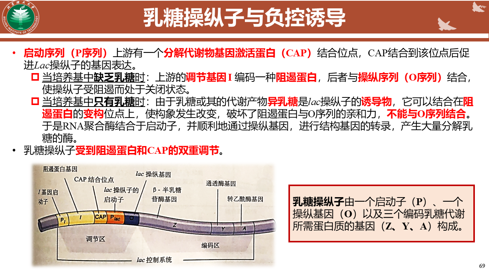
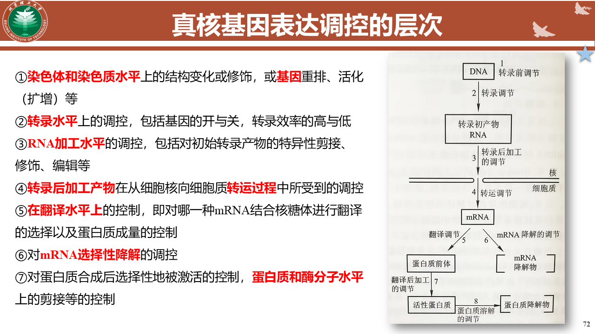
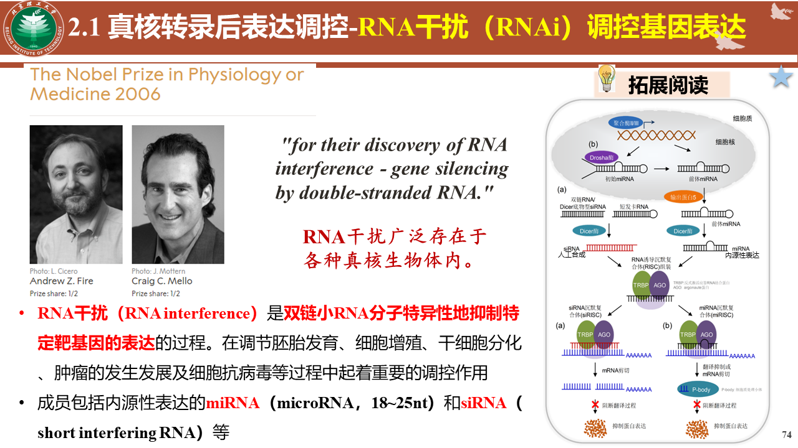
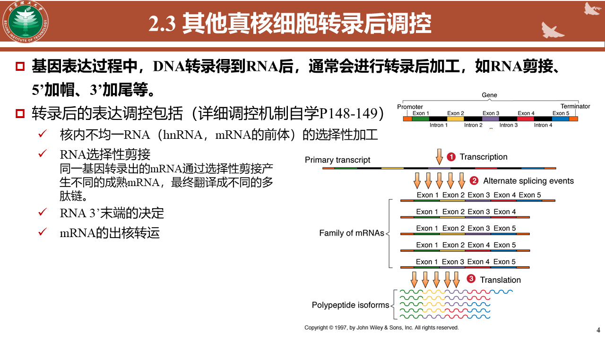
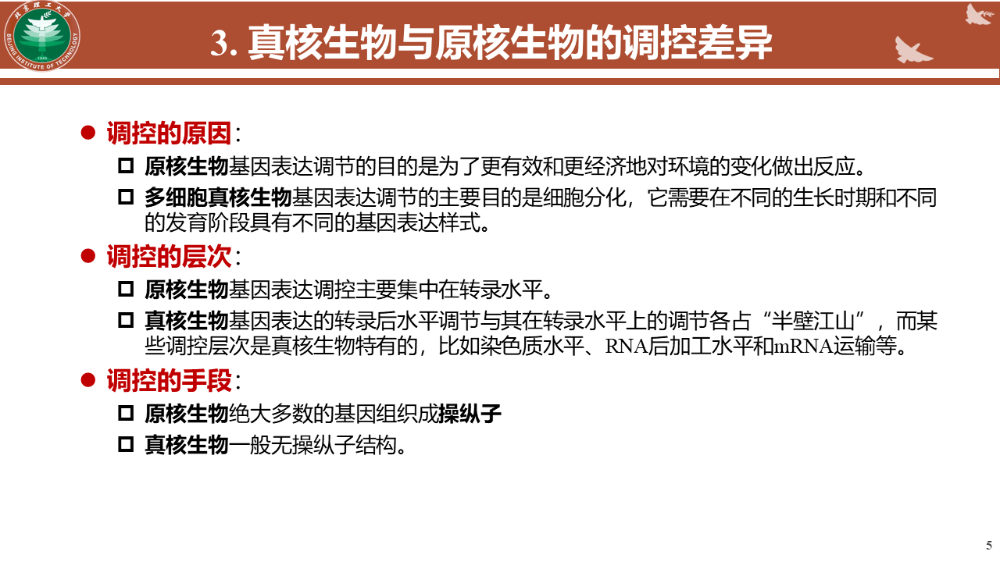
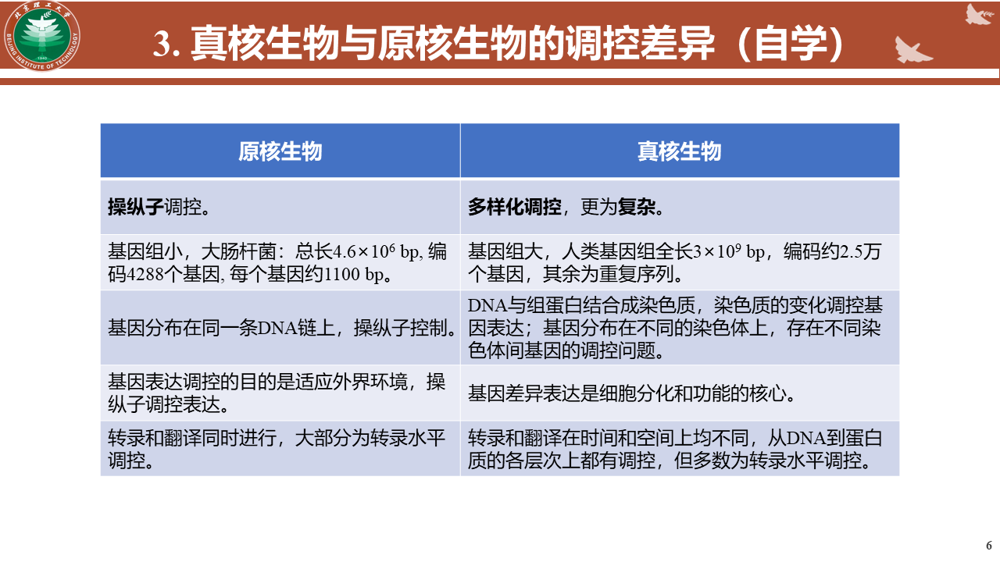

# 基因表达调控

### 基因的表达调控
是生物体内基因表达的调节控制，使细胞中基因表达的过程在时间、空间上处于有序状态，并对环境条件的变化做出反应的复杂过程。
- 是生物体内细胞分化、形态发生和个体发育的分子基础。
**不同表达模式**
    - 管家基因：在不同细胞类型及生长发育时期表达相同
    - 奢侈基因：与细胞分化、组织器官及生物体适应环境所需而表达的基因
**基因调控的方式**
    - 转录水平调控：
        转路过程的调控
        转录产物加工的调控
    - 转录后水平调控
        翻译水平的调控
        翻译后的加工
**调控机制**
    - 正转录调控:调节基因编码*激活蛋白*，促进结构基因转录
        正控诱导
        正控阻遏
    - 负转录诱导
    调节基因编码阻遏蛋白，阻止结构基因转录
        负控诱导
        负控阻遏

### 原核基因表达调控
**操纵子**
原核生物基因表达调控的一种重要组织形式，原核生物中几个功能相关的基因成簇串联排列组成的一个基因表达协同单位。*是启动基因、操纵基因和一系列紧密连锁的结构基因的总称*
#### 乳糖操纵子与负控诱导

### 真核生物基因表达的调控
**特点**
    - 多种RNA聚合酶
    - 处于转录激活的染色质结构发生明显变化
    - 正性调节为主导
    - 转录与翻译分隔进行
    - 转路后修饰、加工更为复杂
    - 不存在超基因式操纵子结构
    - 主要通过顺式作用元件（存在于DNA上的特定序列）与反式作用因子（与转录调控有关的蛋白质或RNA分子）和RNA聚合酶的相互作用完成
**层次**

###### RNA干扰调控基因表达

###### 表观遗传修饰介导的调控
**特点**
    - 没有DNA序列的改变
    - 可遗传
    - 可逆的基因表达调控
###### 其他真核细胞转录后调控

### 真核生物与原核生物的调控差异

