# 遗传突变与分子治疗

### 基因突变
##### 原因
- 物理因素：电离辐射、紫外线
- 化学：黄曲霉素、苯并芘等诱导剂
- 生物：病毒感染
##### 概念
DNA发生碱基对组成或排列顺序的改变
可导致：遗传病、肿瘤、群体中的基因多样性，为生物进化提供遗传变异
##### 类型
###### 碱基替换
转换
颠换：嘌呤取代嘧啶，嘧啶取代嘌呤
**效应**
    同义突变：
    错义突变：替换成另一种氨基酸
    无义突变：变成终止密码子
    终止密码突变：终止密码子变成编码密码子
##### 核苷酸的插入或丢失
- 移码突变：
在DNA编码顺序中插入或缺失一个或几个碱基对
- 3个或2倍数
- **动态突变**
它涉及到基因编码区或非编码区的核苷酸重复序列，特别是三核苷酸重复序列的拷贝数发生扩增。这种突变的特点是在代间传递过程中，重复序列的拷贝数可能会不稳定地持续扩增，导致遗传物质的不稳定状态。
##### 遗传重组
任何原因导致的不同DNA分子间发生的共价连接，造成DNA序列的重新排列。
    - 同源重组：较大范围的同源序列之间发生碱基互补结合
    - 位点特异性重组：以小范围的DNA同源序列为特殊位点，供重组蛋白识别，发生不对等的交换，需要位点专一性蛋白因子参与
    - 转座作用：
    **转座子**：基因组中具有转位特性的DNA序列，有些可自主复制。从染色体的一个区段转移到另一个区段，或从一条染色体转移到另一条染色体，或将新的拷贝转移到基因组其他地方。
    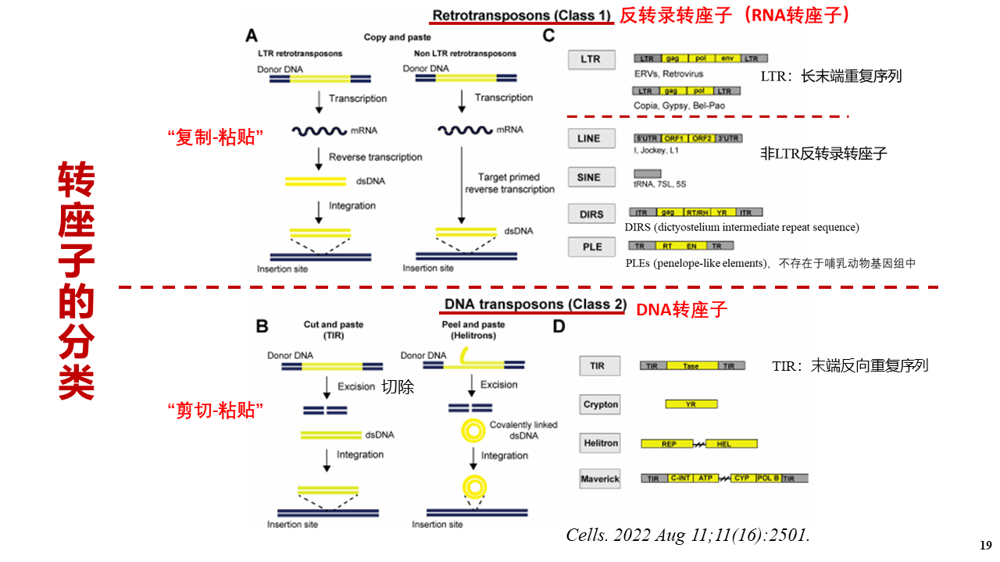
        - **反转录转座子**
        以RNA为中介，反转录成DNA后进行转座的可动元件，只有真核生物才有。
        **反转录病毒**
        基因的三种形式
            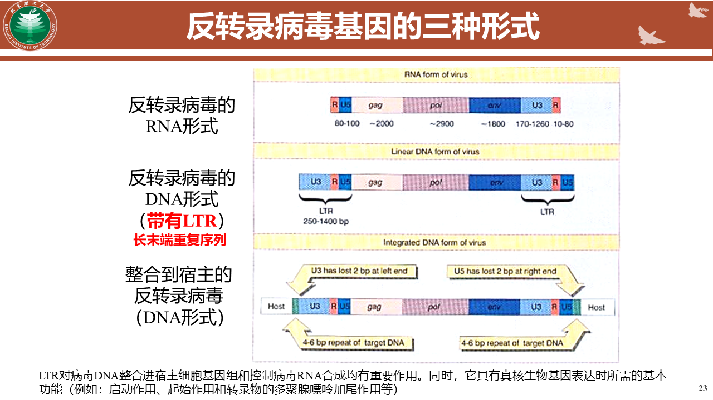
            **长散在重复序列**
            是非LTR反转录转座子中可自主转座的转座子。，3000-7000
            L1是LINE的一个重复序列，凝血因子VIII基因插入L1导致血友病。
            **短散在重复序列**
            不可自主转座，不可编码反转录酶或整合酶。可在自主转座子酶的帮助下实现转座。300-500bp

##### 表观遗传变异
DNA序列不改变，但是RNA编辑、组蛋白的化学修饰、RNA的选择性剪接等，使基因发生可遗传的改变的现象，称为表观遗传变异。
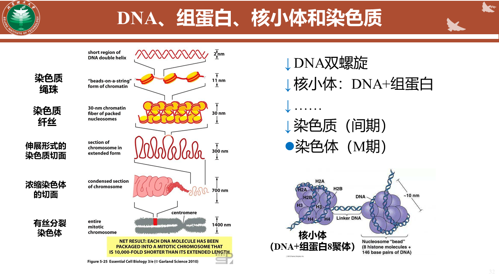
- DNA甲基化：一般与基因沉默相关
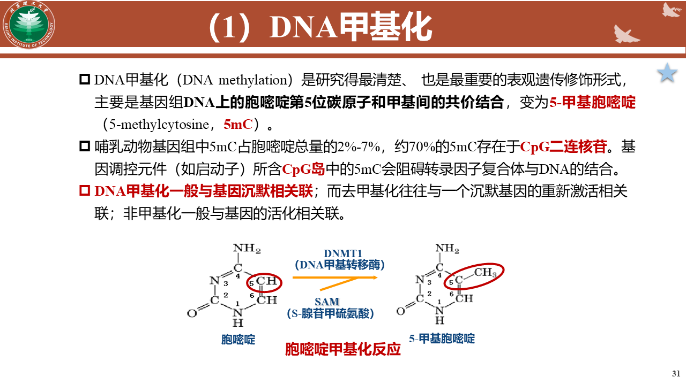
- 组蛋白修饰
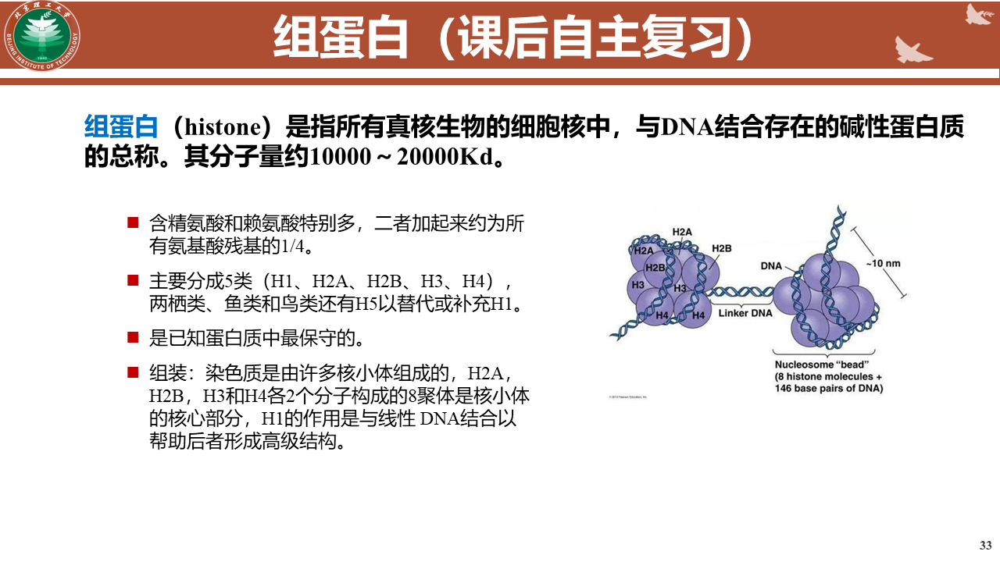
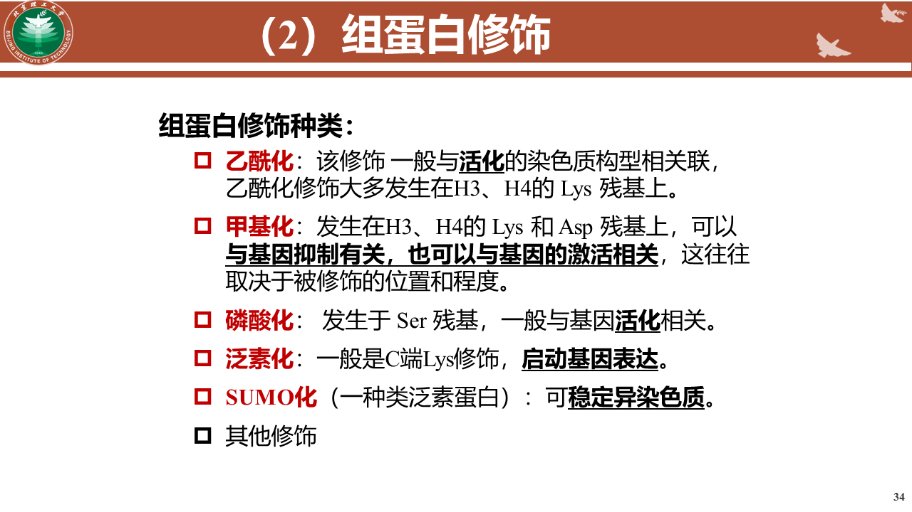
- 染色质重塑
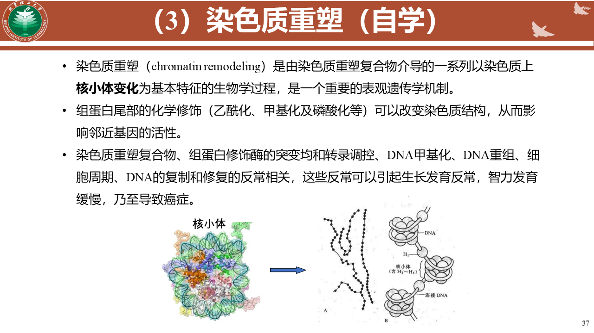
- 非编码RNA调控
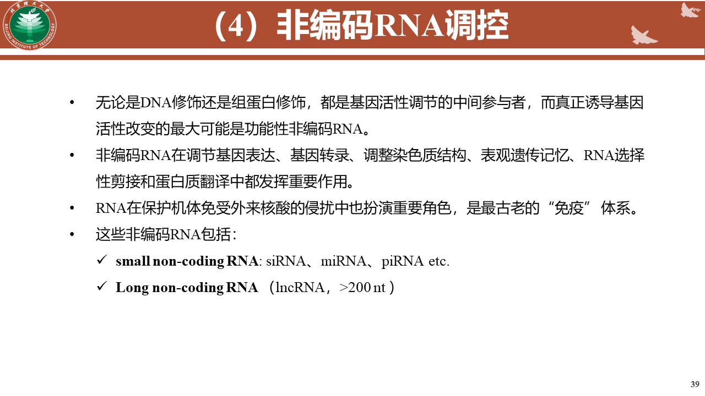

### 遗传病
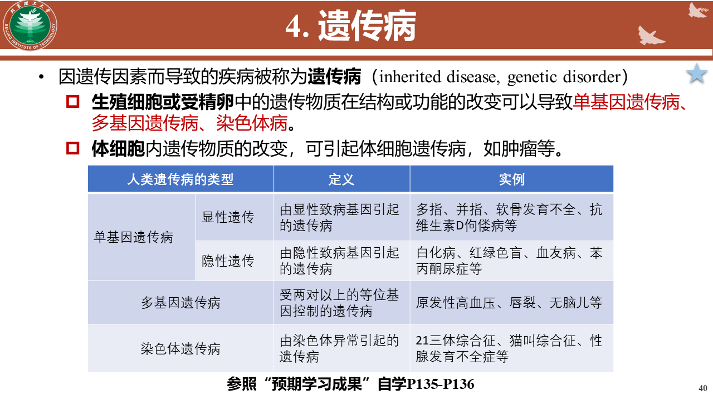
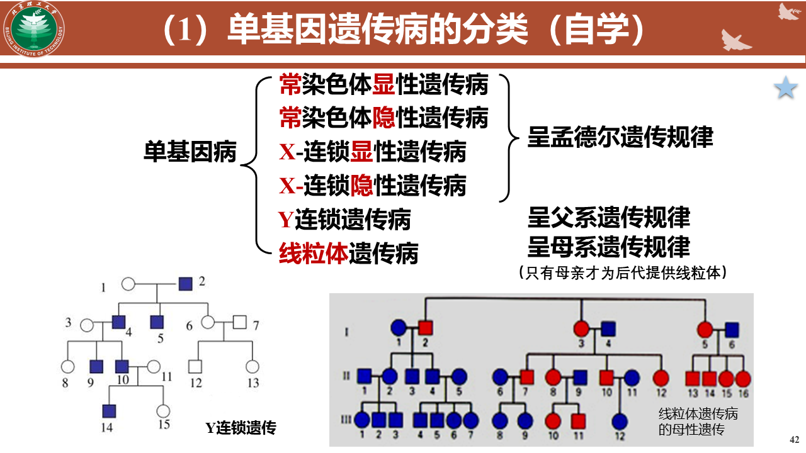
##### 多基因病
特点
- 家族聚集倾向
- 血缘关系疏远、发病风险降低
- 发病率有种族差异
- 再现率随妊娠次数及疾病严重程度而相应增高
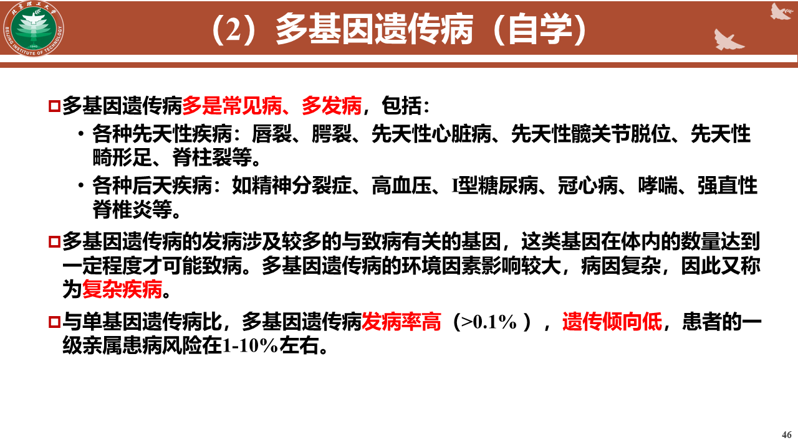
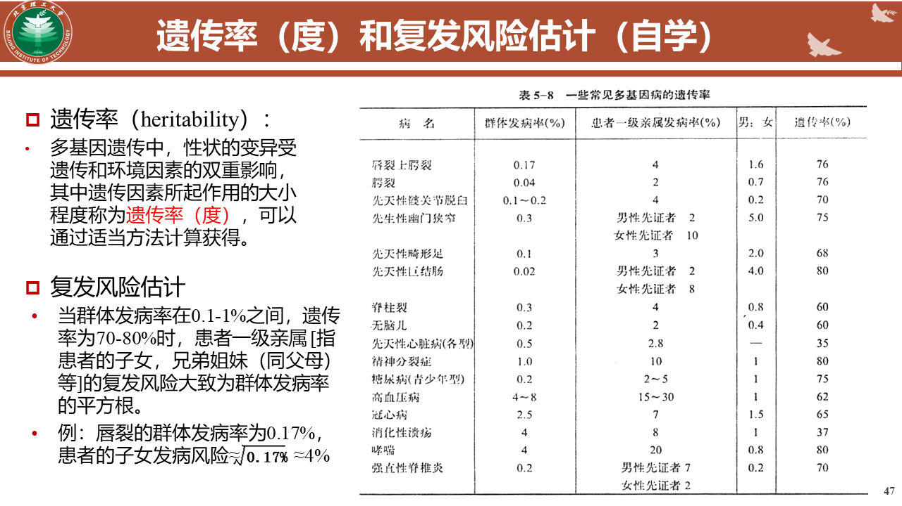

##### 染色体病
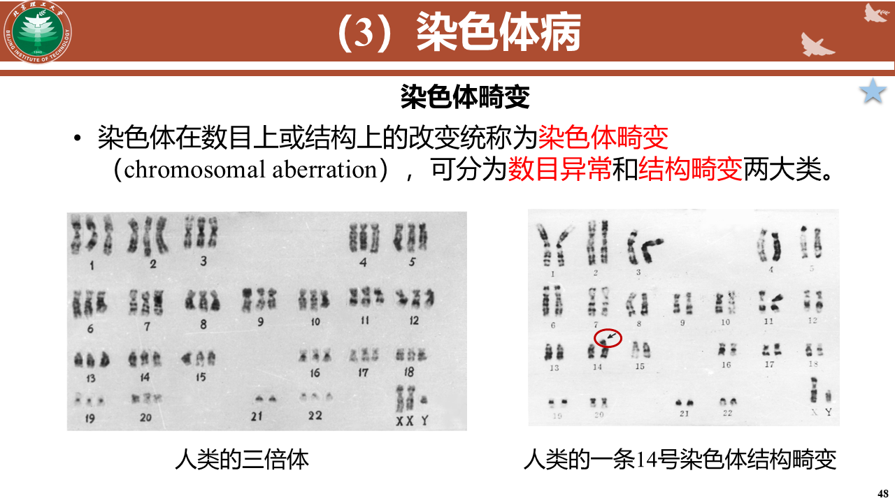
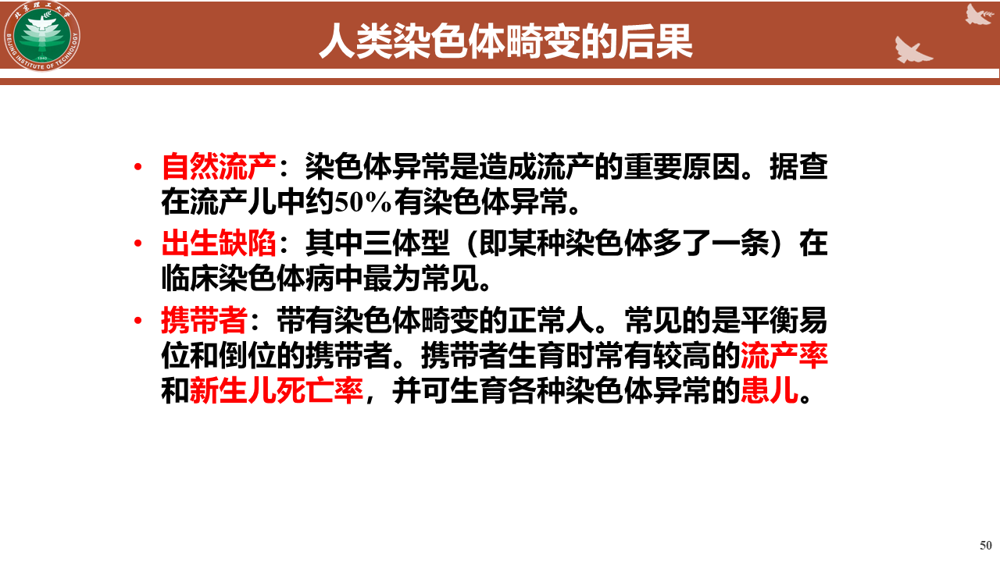

### 突变的检测与分析
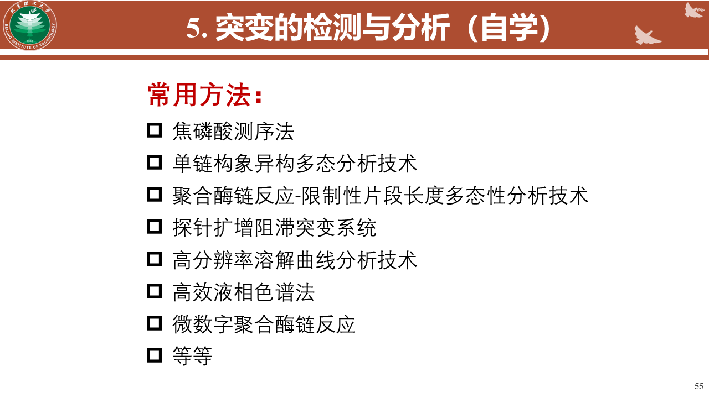

### 疾病的分子诊断与治疗
**分子诊断**
应用分子生物学方法检测患者体内标志分子的结构或表达水平变化而做出诊断
**精准医学**
精准医学是一种医疗模式，它考虑个体的遗传信息、环境、生活方式和发病情况，以提供更精确的诊断和治疗。
**基因治疗**
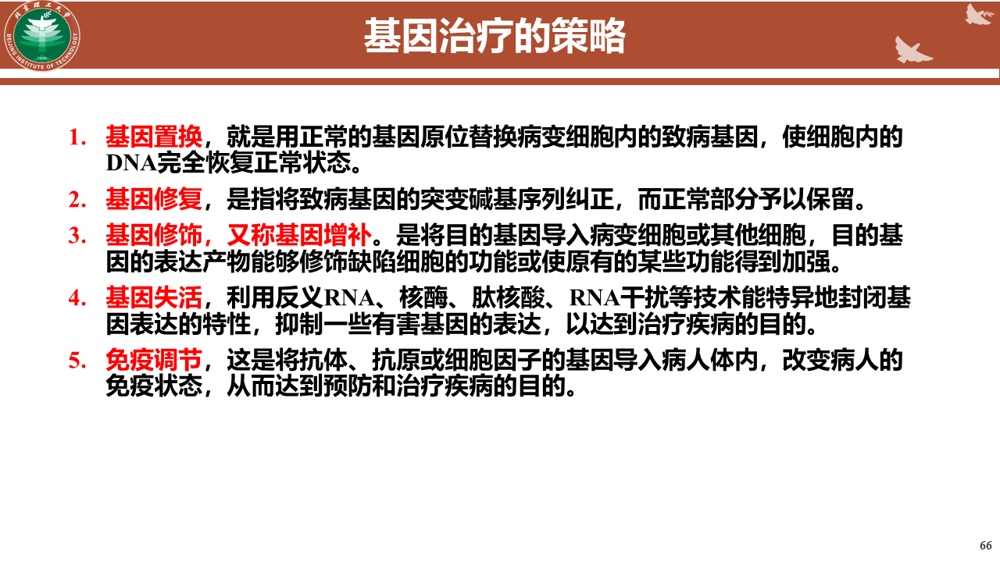

