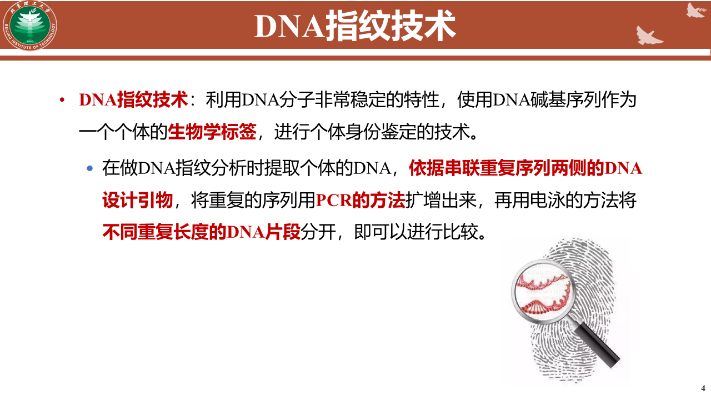
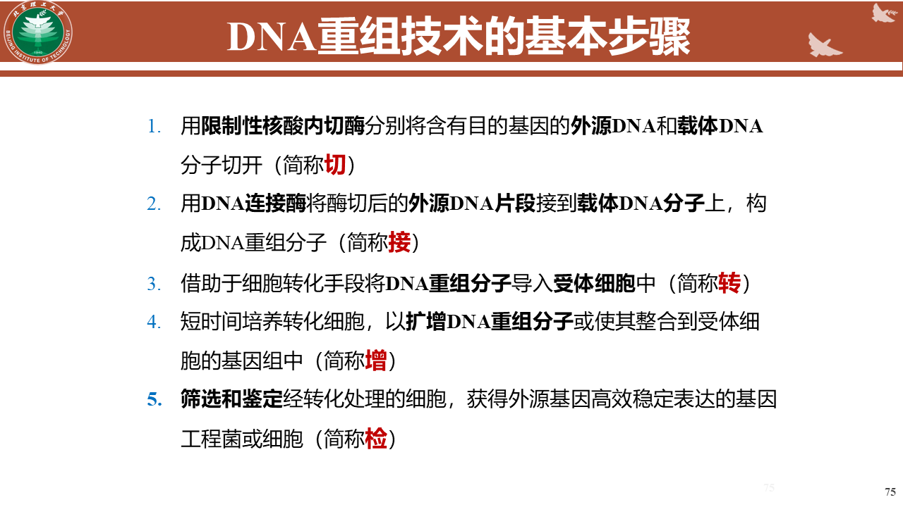
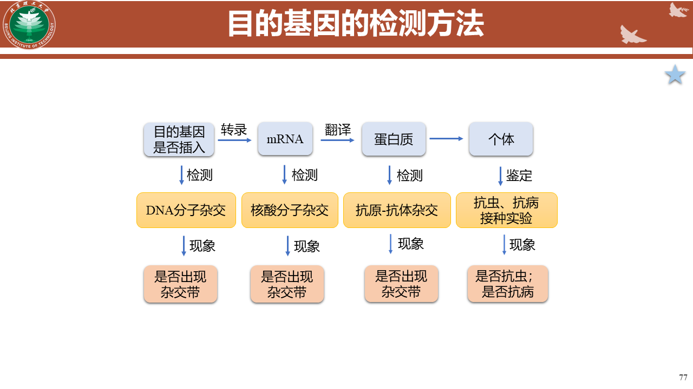
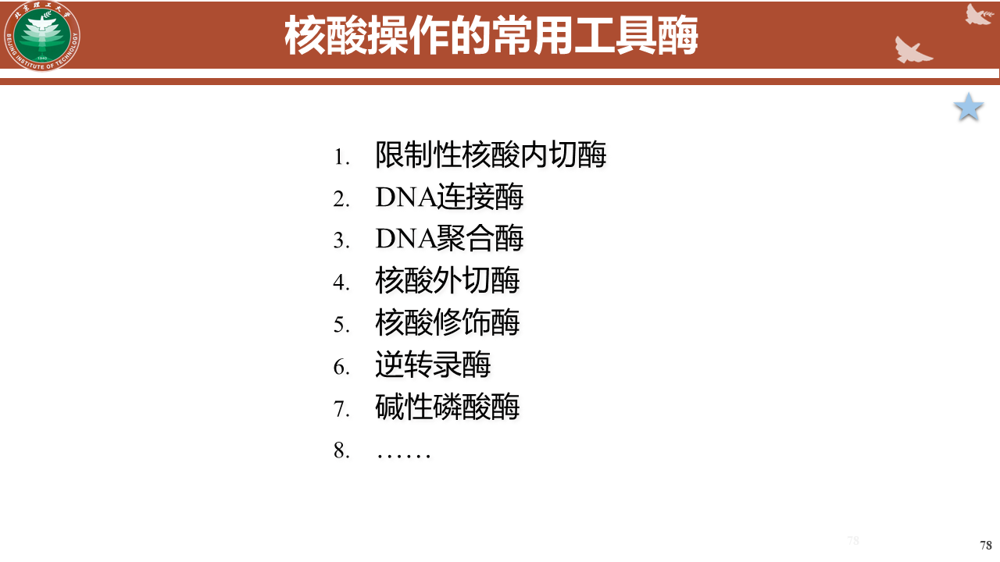
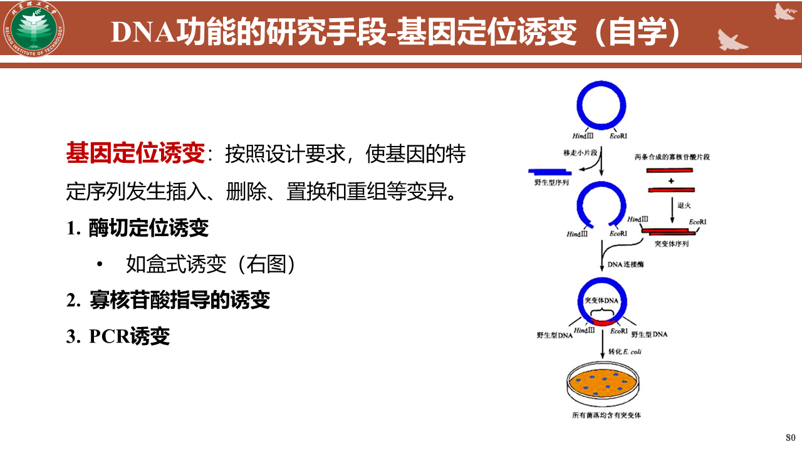
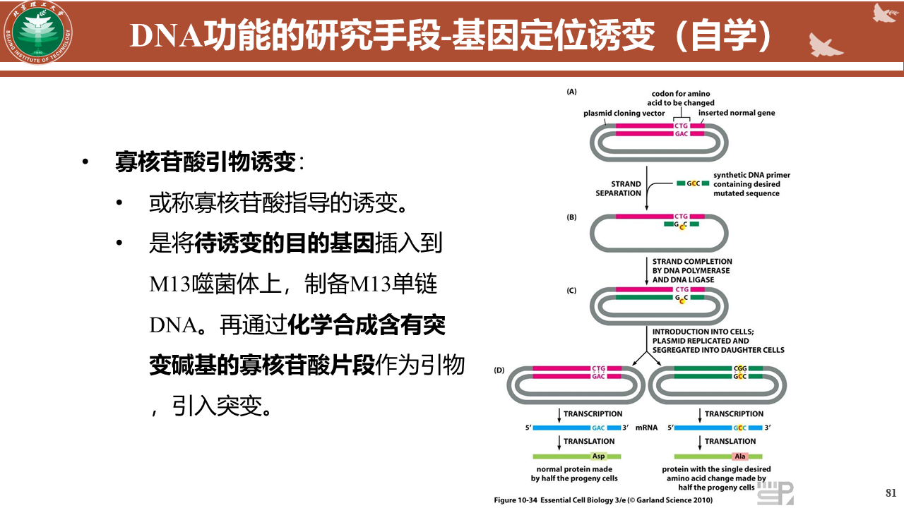
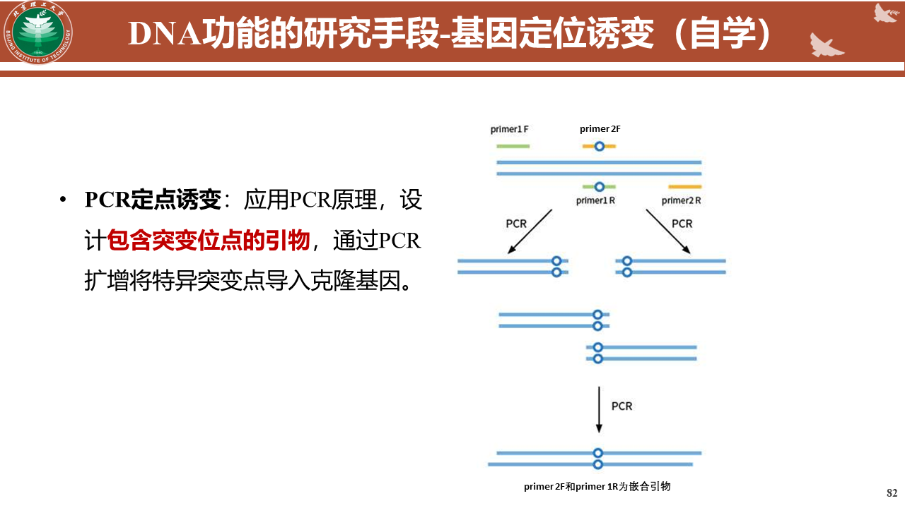

# 基因组
### 基因组概述
**概念**
- 广义：一个物种的全部遗传物质及其携带的遗传信息。包括了该物种全套的常染色体、性染色体线粒体和叶绿体所带有的全部DNA序列总和。
- 狭义： 某一个个体，如一个人的基因组。

### 原核生物基因组

#### 人类基因组

人类基因组仅有少部分（1-2%）DNA具有编码蛋白质的功能，巨大部分是间隔序列、基因内的插入序列、重复序列等非编码序列
	基因相关序列
		编码序列
		非编码序列
			内含子、启动子、前导、后随序列
			假基因
			基因片段
	基因外序列
		高、中度重复序列
			散布重复序列
				LTR反转录转座子
				非LTR反转录转座子
				剪切-粘贴的转座子
			串联重复序列
				卫星DNA
				小卫星DNA
				微卫星DNA
		单拷贝、低拷贝序列

##### 串联重复序列
广泛含有的首尾相连呈长串联状的重复序列
**卫星DNA**
    一类重复单元很大的高度重复序列，通常其长度是100-5000bp，一般在染色体的异染色质区
**小卫星DNA**
    6-25个核苷酸为重复单元的串联重复序列称为小卫星DNA
    - 无亲属关系之间的重复次数不一样——DNA指纹分析
**微卫星DNA**
    2-6个核苷酸为重复单元的串联重复序列
    - 逐渐替代小卫星成为DNA指纹分析的主要手段
**DNA指纹分析**

### DNA 重组技术
**基因工程**
用生物技术对有机体的基因组进行直接的操作。是人为地将外源目的基因插入质粒、病毒或其他载体，构成遗传物质的新组合，并将这种遗传物质导入宿主或者细胞中，从而使宿主或者细胞获得新的遗传特性或形成新的基因产物。
**遗传工程**，有目的地将一个供体细胞内的DNA片段与另一个不同的DNA分子进行遗传重组，形成重组DNA分子，可以转移到其他细胞中使之产生新的遗传形状。
##### 基本步骤
**切接转增检**

**目的基因的检测方法**

**核酸操作的常用工具酶**

### 生物信息学
**概念**
生物信息学是应用数学、统计学、信息科学和计算机科学的原理和方法来管理、分析和解释生物数据的学科。
